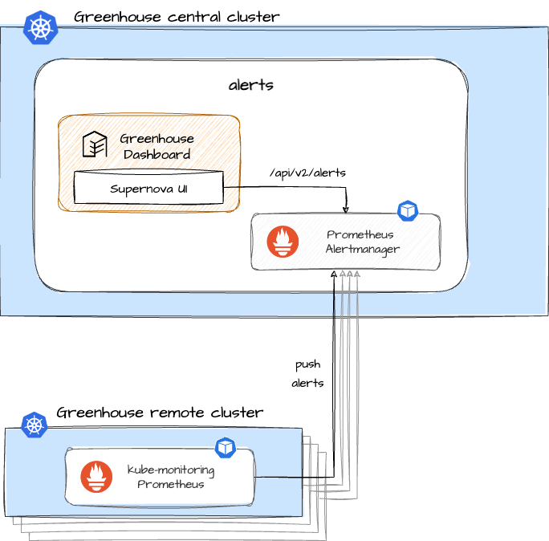

Learn more about the **alertmanager** plugin. Use it to activate Prometheus alert management for your Greenhouse organisation.

The main terminologies used in this document can be found in [core-concepts](https://cloudoperators.github.io/greenhouse/docs/getting-started/core-concepts).


## Overview

This Plugin includes a preconfigured [_Prometheus Alertmanager_](https://prometheus.io/docs/alerting/latest/alertmanager/), which is deployed and managed via the [_Prometheus_ Operator](https://github.com/prometheus-operator/prometheus-operator). Certificates are automatically generated to enable sending alerts from _Prometheus_ to Alertmanager. These alerts can too be sent as Slack notifications with a provided set of notification templates.

Components included in this Plugin:

- [Prometheus Alertmanager](https://prometheus.io/docs/alerting/alertmanager)

This Plugin usually is deployed along the **kube-monitoring** Plugin and does not deploy the [Prometheus Operator](https://github.com/prometheus-operator/prometheus-operator) itself. However, if you are intending to use it stand-alone, you need to explicitly enable the deployment of Prometheus Operator, otherwise it will not work. It can be done in the configuration interface of the plugin.



## Disclaimer

This is not meant to be a comprehensive package that covers all scenarios. If you are an expert, feel free to configure the plugin according to your needs.

The Plugin is a deeply configured [kube-prometheus-stack](https://github.com/prometheus-community/helm-charts/blob/main/charts/kube-prometheus-stack/README.md) Helm chart which helps to keep track of versions and community updates.

It is intended as a platform that can be extended by following the [guide](#managing-alertmanager-configuration). 

Contribution is highly appreciated. If you discover bugs or want to add functionality to the plugin, then pull requests are always welcome.

## Quick start

This guide provides a quick and straightforward way to use **alertmanager** as a Greenhouse Plugin on your Kubernetes cluster.

**Prerequisites**

- A running and Greenhouse-onboarded Kubernetes cluster. If you don't have one, follow the [Cluster onboarding](https://cloudoperators.github.io/greenhouse/docs/user-guides/cluster/onboarding) guide.
- kube-monitoring plugin (which brings in Prometheus Operator) **OR** stand alone: awareness to enable the deployment of Prometheus Operator with this plugin


**Step 1:**

You can install the `alertmanager` package in your cluster with [Helm](https://helm.sh/docs/helm/helm_install) manually or let the Greenhouse platform lifecycle it for you automatically. For the latter, you can either:
  1. Go to Greenhouse dashboard and select the *Alertmananger* Plugin from the catalog. Specify the cluster and required option values.
  2. Create and specify a `Plugin` resource in your Greenhouse central cluster according to the [examples](#examples).

**Step 2:**

Greenhouse regularly performs integration tests that are bundled with **alertmanager**. These provide feedback on whether all the necessary resources are installed and continuously up and running. You will find messages about this in the plugin status and also in the Greenhouse dashboard.

**Step 3:**

To get the UI to work you need to enable the Supernova UI using the supernova plugin. Therefore the endpoint to alertmanager needs to be provided.

## Configuration

### Prometheus Alertmanager options

| Name                                                                     | Description                                                                                                                | Value   |
| ------------------------------------------------------------------------ | -------------------------------------------------------------------------------------------------------------------------- | ------- |
| `global.caCert`                                                          | Additional caCert to add to the CA bundle                                                                                  | `""`    |
| `alertmanager.commonLabels`                                              | Labels to apply to all resources                                                                                           | `{}`    |
| `alertmanager.defaultRules.create`                                       | Creates community Alertmanager alert rules.                                                                                | `true`  |
| `alertmanager.defaultRules.labels`                                       | kube-monitoring `plugin: <plugin.name>` to evaluate Alertmanager rules.                                                    | `{}`    |
| `alertmanager.alertmanager.enabled`                                      | Deploy Prometheus Alertmanager                                                                                             | `true`  |
| `alertmanager.alertmanager.annotations`                                  | Annotations for Alertmanager                                                                                               | `{}`    |
| `alertmanager.alertmanager.config`                                       | Alertmanager configuration directives.                                                                                     | `{}`    |
| `alertmanager.alertmanager.ingress.enabled`                              | Deploy Alertmanager Ingress                                                                                                | `false` |
| `alertmanager.alertmanager.ingress.hosts`                                | Must be provided if Ingress is enabled.                                                                                    | `[]`    |
| `alertmanager.alertmanager.ingress.tls`                                  | Must be a valid TLS configuration for Alertmanager Ingress. Supernova UI passes the client certificate to retrieve alerts. | `{}`    |
| `alertmanager.alertmanager.ingress.ingressClassname`                     | Specifies the ingress-controller                                                                                           | `nginx` |
| `alertmanager.alertmanager.servicemonitor.additionalLabels`              | kube-monitoring `plugin: <plugin.name>` to scrape Alertmanager metrics.                                                    | `{}`    |
| `alertmanager.alertmanager.alertmanagerConfig.slack.routes[].name`       | Name of the Slack route.                                                                                                   | `""`    |
| `alertmanager.alertmanager.alertmanagerConfig.slack.routes[].channel`    | Slack channel to post alerts to. Must be defined with `slack.webhookURL`.                                                  | `""`    |
| `alertmanager.alertmanager.alertmanagerConfig.slack.routes[].webhookURL` | Slack webhookURL to post alerts to. Must be defined with `slack.channel`.                                                  | `""`    |
| `alertmanager.alertmanager.alertmanagerConfig.slack.routes[].matchers`   | List of matchers that the alert's label should match. matchType <string>, name <string>, regex <boolean>, value <string>   | `[]`    |
| `alertmanager.alertmanager.alertmanagerConfig.webhook.routes[].name`     | Name of the webhook route.                                                                                                 | `""`    |
| `alertmanager.alertmanager.alertmanagerConfig.webhook.routes[].url`      | Webhook url to post alerts to.                                                                                             | `""`    |
| `alertmanager.alertmanager.alertmanagerConfig.webhook.routes[].matchers` | List of matchers that the alert's label should match. matchType <string>, name <string>, regex <boolean>, value <string>   | `[]`    |
| `alertmanager.alertmanager.alertmanagerSpec.alertmanagerConfiguration`   | AlermanagerConfig to be used as top level configuration                                                                    | `false` |
| `alertmanager.alertmanager.alertmanagerConfig.webhook.routes[].matchers` | List of matchers that the alert's label should match. matchType <string>, name <string>, regex <boolean>, value <string>   | `[]`    |

### cert-manager options


| Name                                                                     | Description                                                                                                                | Value   |
| ------------------------------------------------------------------------ | -------------------------------------------------------------------------------------------------------------------------- | ------- |
| `alertmanager.certManager.enabled`                                       | Creates `jetstack/cert-manager` resources to generate Issuer and Certificates for Prometheus authentication.               | `true`  |
| `alertmanager.certManager.rootCert.duration`                             | Duration, how long the root certificate is valid.                                                                          | `"5y"`  |
| `alertmanager.certManager.admissionCert.duration`                        | Duration, how long the admission certificate is valid.                                                                     | `"1y"`  |
| `alertmanager.certManager.issuerRef.name`                                | Name of the existing Issuer to use.                                                                                        | `""`    |

### Managing Alertmanager configuration

ref:

- https://prometheus.io/docs/alerting/configuration/#configuration-file
- https://prometheus.io/webtools/alerting/routing-tree-editor/

By default, the Alertmanager instances will start with a minimal configuration which isn’t really useful since it doesn’t send any notification when receiving alerts.

You have multiple options to provide the Alertmanager configuration:

1. You can use `alertmanager.alertmanager.config` to define a Alertmanager configuration. Example below.

```yaml
config:
  global:
    resolve_timeout: 5m
  inhibit_rules:
    - source_matchers:
        - "severity = critical"
      target_matchers:
        - "severity =~ warning|info"
      equal:
        - "namespace"
        - "alertname"
    - source_matchers:
        - "severity = warning"
      target_matchers:
        - "severity = info"
      equal:
        - "namespace"
        - "alertname"
    - source_matchers:
        - "alertname = InfoInhibitor"
      target_matchers:
        - "severity = info"
      equal:
        - "namespace"
  route:
    group_by: ["namespace"]
    group_wait: 30s
    group_interval: 5m
    repeat_interval: 12h
    receiver: "null"
    routes:
      - receiver: "null"
        matchers:
          - alertname =~ "InfoInhibitor|Watchdog"
  receivers:
    - name: "null"
  templates:
    - "/etc/alertmanager/config/*.tmpl"
```

2. You can discover `AlertmanagerConfig` objects. The `spec.alertmanagerConfigSelector` is always set to `matchLabels`: `plugin: <name>` to tell the operator which `AlertmanagerConfigs` objects should be selected and merged with the main Alertmanager configuration. Note: The default strategy for a `AlertmanagerConfig` object to match alertmanager is `OnNamespace`.

```yaml
apiVersion: monitoring.coreos.com/v1alpha1
kind: AlertmanagerConfig
metadata:
  name: config-example
  labels:
    alertmanagerConfig: example
    pluginDefinition: alerts-example
spec:
  route:
    groupBy: ["job"]
    groupWait: 30s
    groupInterval: 5m
    repeatInterval: 12h
    receiver: "webhook"
  receivers:
    - name: "webhook"
      webhookConfigs:
        - url: "http://example.com/"
```

3. You can use `alertmanager.alertmanager.alertmanagerSpec.alertmanagerConfiguration` to reference an `AlertmanagerConfig` object in the same namespace which defines the main Alertmanager configuration.

```yaml
# Example with select a global alertmanagerconfig
alertmanagerConfiguration:
  name: global-alertmanager-configuration
```

## TLS Certificate Requirement

Greenhouse onboarded Prometheus installations need to communicate with the Alertmanager component to enable processing of alerts. If an Alertmanager Ingress is enabled, this requires a TLS certificate to be configured and trusted by Alertmanger to ensure the communication. To enable automatic self-signed TLS certificate provisioning via cert-manager, set the `alertmanager.certManager.enabled` value to `true`.

Note: Prerequisite of this feature is a installed [jetstack/cert-manager](https://github.com/jetstack/cert-manager) which can be implemented via the Greenhouse [cert-manager](https://github.com/cloudoperators/greenhouse-extensions/tree/main/cert-manager) Plugin.

## Examples

### Deploy alertmanager with Alertmanager

```yaml
apiVersion: greenhouse.sap/v1alpha1
kind: Plugin
metadata:
  name: alertmanager
spec:
  pluginDefinition: alertmanager
  disabled: false
  displayName: alertmanager
  optionValues:
    - name: alertmanager.alertmanager.enabled
      value: true
    - name: alertmanager.alertmanager.ingress.enabled
      value: true
    - name: alertmanager.alertmanager.ingress.hosts
      value:
        - alertmanager.dns.example.com
    - name: alertmanager.alertmanager.ingress.tls
      value:
        - hosts:
            - alertmanager.dns.example.com
          secretName: tls-alertmanager-dns-example-com
    - name: alertmanager.alertmanagerConfig.slack.routes
      value:
        - channel: slack-warning-channel
          webhookURL: https://hooks.slack.com/services/some-id
          matchers:
            - name: severity
              matchType: "="
              value: "warning"
        - channel: slack-critical-channel
          webhookURL: https://hooks.slack.com/services/some-id
          matchers:
            - name: severity
              matchType: "="
              value: "critical"
    - name: alertmanager.alertmanagerConfig.webhook.routes
      value:
        - name: webhook-route
          url: https://some-webhook-url
          matchers:
            - name: alertname
              matchType: "=~"
              value: ".*"
    - name: alertmanager.alertmanager.serviceMonitor.additionalLabels
      value:
        plugin: kube-monitoring
    - name: alertmanager.defaultRules.create
      value: true
    - name: alertmanager.defaultRules.labels
      value:
        plugin: kube-monitoring
    - name: endpoint
      value: https://alertmanager.dns.example.com/api/v2
    - name: filterLabels
      value:
        - job
        - severity
        - status
    - name: silenceExcludedLabels
      value:
        - pod
        - pod_name
        - instance
```

