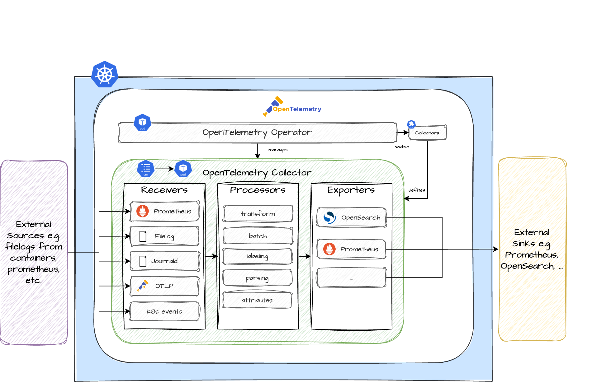

Learn more about the **Audit Logs** Plugin. Use it to enable the ingestion, collection and export of telemetry signals (logs and metrics) for your Greenhouse cluster.

The main terminologies used in this document can be found in [core-concepts](https://cloudoperators.github.io/greenhouse/docs/getting-started/core-concepts).

## Overview

OpenTelemetry is an observability framework and toolkit for creating and managing telemetry data such as metrics, logs and traces. Unlike other observability tools, OpenTelemetry is vendor and tool agnostic, meaning it can be used with a variety of observability backends, including open source tools such as _OpenSearch_ and _Prometheus_.

The focus of the Plugin is to provide easy-to-use configurations for common use cases of receiving, processing and exporting telemetry data in Kubernetes. The storage and visualization of the same is intentionally left to other tools.

Components included in this Plugin:

- [Collector](https://github.com/open-telemetry/opentelemetry-collector)
- [Receivers](https://github.com/open-telemetry/opentelemetry-collector/blob/main/receiver/README.md)
    - [Filelog Receiver](https://github.com/open-telemetry/opentelemetry-collector-contrib/tree/main/receiver/filelogreceiver)
    - [k8sevents Receiver](https://github.com/open-telemetry/opentelemetry-collector-contrib/tree/main/receiver/k8seventsreceiver)
    - [journald Receiver](https://github.com/open-telemetry/opentelemetry-collector-contrib/tree/main/receiver/journaldreceiver)
    - [prometheus/internal](https://opentelemetry.io/docs/collector/internal-telemetry/)
- [Connector](https://opentelemetry.io/docs/collector/building/connector/)
- [OpenSearch Exporter](https://github.com/open-telemetry/opentelemetry-collector-contrib/tree/main/exporter/opensearchexporter)

## Architecture

## Note

It is the intention to add more configuration over time and contributions of your very own configuration is highly appreciated. If you discover bugs or want to add functionality to the Plugin, feel free to create a pull request.

## Quick Start

This guide provides a quick and straightforward way to use **OpenTelemetry** for Logs as a Greenhouse Plugin on your Kubernetes cluster.

**Prerequisites**

- A running and Greenhouse-onboarded Kubernetes cluster. If you don't have one, follow the [Cluster onboarding](https://cloudoperators.github.io/greenhouse/docs/user-guides/cluster/onboarding) guide.
- For logs, a OpenSearch instance to store. If you don't have one, reach out to your observability team to get access to one.
- We recommend a running cert-manager in the cluster before installing the **Logs** Plugin
- To gather metrics, you **must** have a Prometheus instance in the onboarded cluster for storage and for managing Prometheus specific CRDs. If you don not have an instance, install the [kube-monitoring](https://cloudoperators.github.io/greenhouse/docs/reference/catalog/kube-monitoring) Plugin first.
- The **Audit Logs** Plugin currently requires the OpenTelemetry Operator bundled in the **Logs Plugin** to be installed in the same cluster beforehand. This is a technical limitation of the **Audit Logs** Plugin and will be removed in future releases.

**Step 1:**

You can install the `Logs` package in your cluster by installing it with [Helm](https://helm.sh/docs/helm/helm_install) manually or let the Greenhouse platform lifecycle do it for you automatically. For the latter, you can either:
  1. Go to Greenhouse dashboard and select the **Logs** Plugin from the catalog. Specify the cluster and required option values.
  2. Create and specify a `Plugin` resource in your Greenhouse central cluster according to the [examples](#examples).

**Step 2:**

The package will deploy the OpenTelemetry collectors and auto-instrumentation of the workload. By default, the package will include a configuration for collecting metrics and logs. The log-collector is currently processing data from the [preconfigured receivers](#Overview):
- Files via the Filelog Receiver
- Kubernetes Events from the Kubernetes API server
- Journald events from systemd journal
- its own metrics

Based on the backend selection the telemetry data will be exporter to the backend.

## Failover Connector

The **Logs** Plugin comes with a [Failover Connector](https://github.com/open-telemetry/opentelemetry-collector-contrib/tree/main/connector/failoverconnector) for OpenSearch for two users. The connector will periodically try to establish a stable connection for the prefered user (`failover_username_a`) and in case of a failed try, the connector will try to establish a connection with the fallback user (`failover_username_b`). This feature can be used to secure the shipping of logs in case of expiring credentials or password rotation.

## Values

| Key | Type | Default | Description |
|-----|------|---------|-------------|
| auditLogs.affinity | object | `{}` | Node affinity rules for the collector DaemonSet pods |
| auditLogs.cluster | string | `nil` | Cluster label for Logging |
| auditLogs.collectorImage.repository | string | `"ghcr.io/cloudoperators/opentelemetry-collector-contrib"` | overrides the default image repository for the OpenTelemetry Collector image. |
| auditLogs.collectorImage.tag | string | `"a8981ba"` | overrides the default image tag for the OpenTelemetry Collector image. |
| auditLogs.customLabels | string | `nil` | Custom labels to apply to all OpenTelemetry related resources |
| auditLogs.elastic.enabled | bool | `false` | Activates the configuration for Elastic. |
| auditLogs.elastic.endpoint | string | `nil` | Endpoint URL for Elastic |
| auditLogs.elastic.labels | list | `[]` | Labels to be added to Elastic logs |
| auditLogs.elastic.tls | object | `{"crt":null,"key":null}` | TLS certificate for Elastic |
| auditLogs.ingesterCollector | object | see values.yaml | Kafka -> OpenSearch ingest collectors for audit logs. One Deployment per entry. |
| auditLogs.ingesterCollector.collectors | object | `{}` | Map of ingest collectors keyed by name. Configured via PluginPreset. |
| auditLogs.ingesterCollector.enabled | bool | `false` | Enable the ingest collectors block. |
| auditLogs.ingesterCollector.image.repository | string | `""` | Image repository override; falls back to auditLogs.collectorImage.repository. |
| auditLogs.ingesterCollector.image.tag | string | `""` | Image tag override; falls back to auditLogs.collectorImage.tag. |
| auditLogs.ingesterCollector.prometheus.podMonitor.enabled | bool | `true` | Render a PodMonitor per enabled ingest collector. |
| auditLogs.ingesterCollector.replicas | int | `1` | Replica count per ingest collector Deployment. |
| auditLogs.ingesterCollector.resources | object | `{}` | Pod resources per ingest collector Deployment. |
| auditLogs.logsCollector.auditd.enabled | bool | `true` | Activates the ingestion of auditd logs. |
| auditLogs.logsCollector.auditpoller.enabled | bool | `false` | Activates the receiver for ingesting audit-poller logs |
| auditLogs.logsCollector.containerd.enabled | bool | `false` | Activates ingestion of container stdout/stderr logs from /var/log/pods |
| auditLogs.logsCollector.enabled | bool | `true` | Activates the standard configuration for Logs. |
| auditLogs.logsCollector.journald.enabled | bool | `false` | Activates ingestion of systemd journal logs |
| auditLogs.logsCollector.kafka | object | `{"brokers":[],"compression":"","enabled":false,"encoding":"","protocol_version":"","tls":{"enabled":false,"insecure_skip_verify":false},"topic":""}` | Kafka exporter configuration for buffering audit logs |
| auditLogs.logsCollector.kafka.brokers | list | `[]` | Kafka broker addresses (e.g., ["kafka-bootstrap.kafka.svc.cluster.local:9092"]) |
| auditLogs.logsCollector.kafka.compression | string | `""` | Compression type (none, gzip, snappy, lz4, zstd) |
| auditLogs.logsCollector.kafka.enabled | bool | `false` | Enable Kafka exporter for audit logs buffering. When enabled, audit logs are exported to Kafka instead of OpenSearch. |
| auditLogs.logsCollector.kafka.encoding | string | `""` | Message encoding format (otlp_json, otlp_proto, raw, opensearch_log_encoding) |
| auditLogs.logsCollector.kafka.protocol_version | string | `""` | Kafka protocol version (e.g., "3.9.0") |
| auditLogs.logsCollector.kafka.tls | object | `{"enabled":false,"insecure_skip_verify":false}` | TLS settings for the Kafka exporter. Enable when the broker terminates TLS. |
| auditLogs.logsCollector.kafka.tls.enabled | bool | `false` | Enable TLS on the connection to Kafka. |
| auditLogs.logsCollector.kafka.tls.insecure_skip_verify | bool | `false` | Skip server certificate verification. Leave false for production. |
| auditLogs.logsCollector.kafka.topic | string | `""` | Kafka topic name for audit logs |
| auditLogs.logsCollector.kubeApiAudit.enabled | bool | `false` | Activates export for kube-apiserver audit logs |
| auditLogs.nodeSelector | object | `{}` |  |
| auditLogs.openSearchLogs.endpoint | string | `nil` | Endpoint URL for OpenSearch |
| auditLogs.openSearchLogs.failover_password_a | string | `nil` | Password for OpenSearch endpoint |
| auditLogs.openSearchLogs.failover_password_b | string | `nil` | Second Password (as a failover) for OpenSearch endpoint |
| auditLogs.openSearchLogs.failover_username_a | string | `nil` | Username for OpenSearch endpoint |
| auditLogs.openSearchLogs.failover_username_b | string | `nil` | Second Username (as a failover) for OpenSearch endpoint |
| auditLogs.openSearchLogs.index | string | `nil` | Name for OpenSearch index |
| auditLogs.openSearchLogs.timeout | string | `"30s"` | Timeout for OpenSearch requests |
| auditLogs.podAnnotations | object | `{}` | Annotations to add to collector pods |
| auditLogs.prometheus.additionalLabels | object | `{}` | Label selectors for the Prometheus resources to be picked up by prometheus-operator. |
| auditLogs.prometheus.podMonitor | object | `{"enabled":false}` | Activates the service-monitoring for the Logs Collector. |
| auditLogs.prometheus.rules | object | `{"additionalRuleLabels":null,"create":true,"labels":{}}` | Default rules for monitoring the opentelemetry components. |
| auditLogs.prometheus.rules.additionalRuleLabels | string | `nil` | Additional labels for PrometheusRule alerts. |
| auditLogs.prometheus.rules.create | bool | `true` | Enables PrometheusRule resources to be created. |
| auditLogs.prometheus.rules.labels | object | `{}` | Labels for PrometheusRules. |
| auditLogs.prometheus.serviceMonitor | object | `{"enabled":false}` | Activates the pod-monitoring for the Logs Collector. |
| auditLogs.region | string | `nil` | Region label for Logging |
| auditLogs.terminationGracePeriodSeconds | int | `30` | Grace period for pod termination in seconds |
| auditPoller.enabled | bool | `false` | Enables the audit-poller deployment for polling IAS audit logs |
| auditPoller.iasApi.alternateApiURL | string | `nil` |  |
| auditPoller.iasApi.apiURL | string | `nil` |  |
| auditPoller.iasApi.fileName | string | `"ias_api.log"` |  |
| auditPoller.iasApi.interval | int | `5` |  |
| auditPoller.iasApi.password | string | `nil` |  |
| auditPoller.iasApi.syncFrom | string | `nil` |  |
| auditPoller.iasApi.tokenURL | string | `nil` |  |
| auditPoller.iasApi.user | string | `nil` |  |
| auditPoller.iasChangelog.fileName | string | `"ias_changelog.log"` |  |
| auditPoller.iasChangelog.interval | int | `30` |  |
| auditPoller.iasChangelog.password | string | `nil` |  |
| auditPoller.iasChangelog.syncFrom | string | `nil` |  |
| auditPoller.iasChangelog.url | string | `nil` |  |
| auditPoller.iasChangelog.user | string | `nil` |  |
| auditPoller.image.repository | string | `""` | Image repository for the audit-poller |
| auditPoller.image.tag | string | `""` | Image tag for the audit-poller |
| auditPoller.logDir | string | `"/audit-poller"` |  |
| auditPoller.logLevel | string | `"info"` |  |
| auditPoller.metricsPort | int | `9298` |  |
| auditPoller.persistence.enabled | bool | `false` |  |
| auditPoller.playbook.basePath | string | `"docs/support/playbook/audit-poller"` | Base path for alert playbook URLs (anchor fragment is appended per alert) |
| commonLabels | string | `nil` | Common labels to apply to all resources |
| extraManifests | list | `[]` | Extra Kubernetes manifests to include in the Helm release. Each entry is rendered as-is (map) or with `tpl` (string). Useful for ConfigMaps that satisfy cluster admission policies. |
| global | object | `{"cluster":"","clusterType":"","prometheus":"","region":""}` | Global values shared with subcharts (audit-poller) |
| global.cluster | string | `""` | Cluster name (defaults to region if empty) |
| global.clusterType | string | `""` | Cluster type identifier |
| global.prometheus | string | `""` | Prometheus label selector for PodMonitor/PrometheusRule resources |
| global.region | string | `""` | Region identifier |

### Examples

TBD
