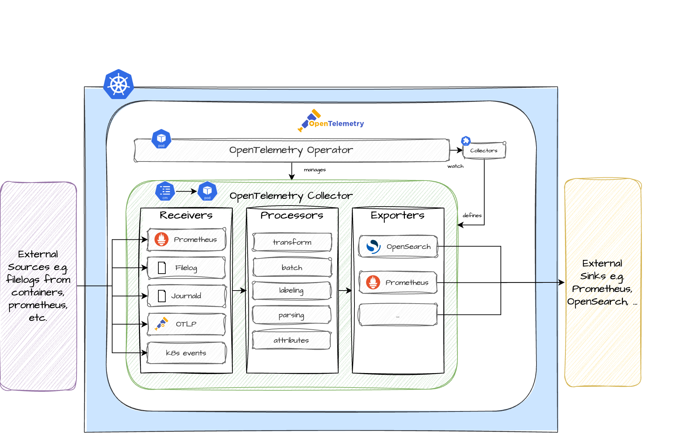

Learn more about the **Audit Logs** Plugin. Use it to enable the ingestion, collection and export of audit relevant logs for your Greenhouse cluster.

The main terminologies used in this document can be found in [core-concepts](https://cloudoperators.github.io/greenhouse/docs/getting-started/core-concepts).

## Overview

OpenTelemetry is an observability framework and toolkit for creating and managing telemetry data such as metrics, logs and traces. OpenTelemetry is vendor and tool agnostic, meaning it can be used with a variety of observability backends. 

The Audit Logs Plugin provides easy-to-use configurations for receiving, processing and exporting audit logs in Kubernetes. By default this plugin exports the audit logs to [OpenSearch](https://opensearch.org) for storage.

Components included in this Plugin:

- [Operator](https://opentelemetry.io/docs/kubernetes/operator/)
- [Collector](https://github.com/open-telemetry/opentelemetry-collector)
- [Receivers](https://github.com/open-telemetry/opentelemetry-collector/blob/main/receiver/README.md)
    - [Filelog Receiver](https://github.com/open-telemetry/opentelemetry-collector-contrib/tree/main/receiver/filelogreceiver)
    - [k8sevents Receiver](https://github.com/open-telemetry/opentelemetry-collector-contrib/tree/main/receiver/k8seventsreceiver)
    - [journald Receiver](https://github.com/open-telemetry/opentelemetry-collector-contrib/tree/main/receiver/journaldreceiver)
    - [prometheus/internal](https://opentelemetry.io/docs/collector/internal-telemetry/)
- [Connector](https://opentelemetry.io/docs/collector/building/connector/) 
- [OpenSearch Exporter](https://github.com/open-telemetry/opentelemetry-collector-contrib/tree/main/exporter/opensearchexporter)

## Architecture

## Note

It is the intention to add more configuration over time and contributions of your very own configuration is highly appreciated. If you discover bugs or want to add functionality to the plugin, feel free to create a pull request.

## Quick Start

This guide provides a quick and straightforward way to use the **Audit Logs Plugin** as a Greenhouse Plugin on your Kubernetes cluster.

**Prerequisites**

- A running and Greenhouse-onboarded Kubernetes cluster. If you don't have one, follow the [Cluster onboarding](https://cloudoperators.github.io/greenhouse/docs/user-guides/cluster/onboarding) guide.
- A log data-sink to store the audit-logs (e.g. OpenSearch). If you don't have one, reach out to your observability team to get access to one.
- We recommend a running cert-manager in the cluster before installing the Audit Logs Plugin
- To gather metrics from the audit logs collectors, you **must** install the [kube-monitoring](https://cloudoperators.github.io/greenhouse/docs/reference/catalog/kube-monitoring) Plugin first; it will install the necessary CRDs for, and install an instance of, the prometheus-operator.

**Step 1:**

You can install the `Audit Logs` plugin in your cluster with [Helm](https://helm.sh/docs/helm/helm_install) manually. 

Otherwise you can let the Greenhouse platform lifecycle do it for you automatically:
  1. Go to Greenhouse dashboard and select the **Audit Logs Plugin** from the catalog.
  1. Specify the cluster.
  1. Set the required option values.
  1. Create and specify a `Plugin` resource in your Greenhouse central cluster according to the [examples](#examples).

**Step 2:**

The package will deploy the OpenTelemetry Operator which works as a manager for the collectors and auto-instrumentation of the workload. By default, the package will include a configuration for collecting audit logs. The log-collector is currently processing data from the [preconfigured receivers](#Overview): 

- Files via the Filelog Receiver
- Kubernetes Events from the Kubernetes API server
- Journald events from systemd journal
- Its own metrics

You can disable the collection of logs by setting `openTelemetry.logCollector.enabled` to `false`.  The `logsCollector` comes with a standard set of log-processing, such as adding cluster information and common labels for Journald events.

**Step 3:**

Greenhouse regularly performs integration tests that are bundled with **Audit Logs**. These provide feedback on whether all the necessary resources are installed and continuously up and running. You will find messages about this in the plugin status and also in the Greenhouse dashboard.

## Failover Connector

The **Audit Logs Plugin** comes with a [Failover Connector](https://github.com/open-telemetry/opentelemetry-collector-contrib/tree/main/connector/failoverconnector) for OpenSearch for two users. The connector will periodically try to establish a stable connection for the preferred user (`failover_username_a`) and in case of a failed try, the connector will try to establish a connection with the fallback user (`failover_username_b`). This feature can be used to secure the shipping of logs in case of expiring credentials or password rotation.

## Configuration

{{ template "chart.valuesSection" . }}

### Examples

TBD
