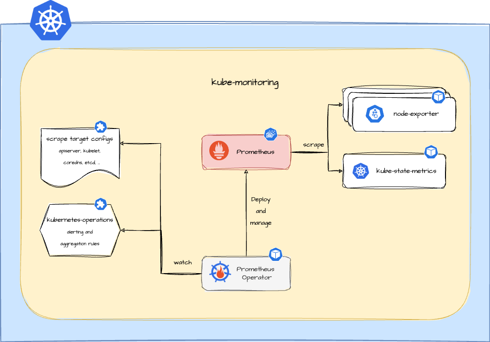

Learn more about the **kube-monitoring** plugin. Use it to activate Kubernetes monitoring for your Greenhouse cluster.

The main terminologies used in this document can be found in [core-concepts](https://cloudoperators.github.io/greenhouse/docs/getting-started/core-concepts).

## Overview

Observability is often required for operation and automation of service offerings. To get the insights provided by an application and the container runtime environment, you need telemetry data in the form of _metrics_ or _logs_ sent to backends such as _Prometheus_ or _OpenSearch_. With the **kube-monitoring** Plugin, you will be able to cover the _metrics_ part of the observability stack.

This Plugin includes a pre-configured package of components that help make getting started easy and efficient. At its core, an automated and managed _Prometheus_ installation is provided using the _prometheus-operator_. This is complemented by Prometheus target configuration for the most common Kubernetes components providing metrics by default. In addition, [Cloud operators](https://github.com/cloudoperators/kubernetes-operations) curated _Prometheus_ alerting rules and _Plutono_ dashboards are included to provide a comprehensive monitoring solution out of the box.



Components included in this Plugin:

- [Prometheus](https://prometheus.io/)
- [Prometheus Operator](https://prometheus-operator.dev/)
- Prometheus target configuration for Kubernetes metrics APIs (e.g. kubelet, apiserver, coredns, etcd)
- [Prometheus node exporter](https://github.com/prometheus/node_exporter)
- [kube-state-metrics](https://github.com/kubernetes/kube-state-metrics)
- [kubernetes-operations](https://github.com/cloudoperators/kubernetes-operations)

## Disclaimer

It is not meant to be a comprehensive package that covers all scenarios. If you are an expert, feel free to configure the plugin according to your needs.

The Plugin is a deeply configured [kube-prometheus-stack](https://github.com/prometheus-community/helm-charts/blob/main/charts/kube-prometheus-stack/README.md) Helm chart which helps to keep track of versions and community updates.

It is intended as a platform that can be extended by following the [guide](#extension-of-the-plugin).

Contribution is highly appreciated. If you discover bugs or want to add functionality to the plugin, then pull requests are always welcome.

## Quick start

This guide provides a quick and straightforward way to use **kube-monitoring** as a Greenhouse Plugin on your Kubernetes cluster.

**Prerequisites**

- A running and Greenhouse-onboarded Kubernetes cluster. If you don't have one, follow the [Cluster onboarding](https://cloudoperators.github.io/greenhouse/docs/user-guides/cluster/onboarding) guide.

**Step 1:**

You can install the `kube-monitoring` package in your cluster by installing it with [Helm](https://helm.sh/docs/helm/helm_install) manually or let the Greenhouse platform lifecycle it for you automatically. For the latter, you can either:
  1. Go to Greenhouse dashboard and select the **Kubernetes Monitoring** plugin from the catalog. Specify the cluster and required option values.
  2. Create and specify a `Plugin` resource in your Greenhouse central cluster according to the [examples](#examples).

**Step 2:**

After installation, Greenhouse will provide a generated link to the Prometheus user interface. This is done via the annotation `greenhouse.sap/expose: “true”` at the Prometheus `Service` resource.

**Step 3:**

Greenhouse regularly performs integration tests that are bundled with **kube-monitoring**. These provide feedback on whether all the necessary resources are installed and continuously up and running. You will find messages about this in the plugin status and also in the Greenhouse dashboard.

## Values

### absent-metrics-operator options

| Key | Type | Default | Description |
|-----|------|---------|-------------|
| absentMetricsOperator.enabled | bool | `false` | Enable [absent-metrics-operator](https://github.com/sapcc/absent-metrics-operator) |

### Alertmanager options

| Key | Type | Default | Description |
|-----|------|---------|-------------|
| alerts.alertmanagers.hosts | list | `[]` | List of Alertmanager hostsd alerts to |
| alerts.alertmanagers.tlsConfig.cert | string | `""` | TLS certificate for communication with Alertmanager |
| alerts.alertmanagers.tlsConfig.key | string | `""` | TLS key for communication with Alertmanager |
| alerts.enabled | bool | `false` | To send alerts to Alertmanager |

### Global options

| Key | Type | Default | Description |
|-----|------|---------|-------------|
| global.commonLabels | object | `{}` | Labels to apply to all resources This can be used to add a `support_group` or `service` label to all resources and alerting rules. |

### Kubernetes component scraper options

| Key | Type | Default | Description |
|-----|------|---------|-------------|
| kubeMonitoring.coreDns.enabled | bool | `true` | Component scraping coreDns. Use either this or kubeDns |
| kubeMonitoring.kubeApiServer.enabled | bool | `true` | Component scraping the kube API server |
| kubeMonitoring.kubeControllerManager.enabled | bool | `false` | Component scraping the kube controller manager |
| kubeMonitoring.kubeDns.enabled | bool | `false` | Component scraping kubeDns. Use either this or coreDns |
| kubeMonitoring.kubeEtcd.enabled | bool | `true` | Component scraping etcd |
| kubeMonitoring.kubeProxy.enabled | bool | `false` | Component scraping kube proxy |
| kubeMonitoring.kubeScheduler.enabled | bool | `false` | Component scraping kube scheduler |
| kubeMonitoring.kubeStateMetrics.enabled | bool | `true` | Component scraping kube state metrics |
| kubeMonitoring.kubelet.enabled | bool | `true` | Component scraping the kubelet and kubelet-hosted cAdvisor |
| kubeMonitoring.kubernetesServiceMonitors.enabled | bool | `true` | Flag to disable all the Kubernetes component scrapers |
| kubeMonitoring.nodeExporter.enabled | bool | `true` | Deploy node exporter as a daemonset to all nodes |

### Prometheus options

| Key | Type | Default | Description |
|-----|------|---------|-------------|
| kubeMonitoring.prometheus.annotations | object | `{}` | Annotations for Prometheus |
| kubeMonitoring.prometheus.enabled | bool | `true` | Deploy a Prometheus instance |
| kubeMonitoring.prometheus.ingress.enabled | bool | `false` | Deploy Prometheus Ingress |
| kubeMonitoring.prometheus.ingress.hosts | list | `[]` | Must be provided if Ingress is enabled |
| kubeMonitoring.prometheus.ingress.ingressClassname | string | `"nginx"` | Specifies the ingress-controller |
| kubeMonitoring.prometheus.prometheusSpec.additionalArgs | list | `[]` | Allows setting additional arguments for the Prometheus container |
| kubeMonitoring.prometheus.prometheusSpec.additionalScrapeConfigs | string | `""` | Next to `ScrapeConfig` CRD, you can use AdditionalScrapeConfigs, which allows specifying additional Prometheus scrape configurations |
| kubeMonitoring.prometheus.prometheusSpec.evaluationInterval | string | `""` | Interval between consecutive evaluations |
| kubeMonitoring.prometheus.prometheusSpec.externalLabels | object | `{}` | External labels to add to any time series or alerts when communicating with external systems like Alertmanager |
| kubeMonitoring.prometheus.prometheusSpec.logLevel | string | `""` | Log level to be configured for Prometheus |
| kubeMonitoring.prometheus.prometheusSpec.podMonitorSelector.matchLabels | object | `{ plugin: <metadata.name> }` | PodMonitors to be selected for target discovery. |
| kubeMonitoring.prometheus.prometheusSpec.probeSelector.matchLabels | object | `{ plugin: <metadata.name> }` | Probes to be selected for target discovery. |
| kubeMonitoring.prometheus.prometheusSpec.retention | string | `""` | How long to retain metrics |
| kubeMonitoring.prometheus.prometheusSpec.ruleSelector.matchLabels | object | `{ plugin: <metadata.name> }` | PrometheusRules to be selected for target discovery. If {}, select all PrometheusRules |
| kubeMonitoring.prometheus.prometheusSpec.scrapeConfigSelector.matchLabels | object | `{ plugin: <metadata.name> }` | scrapeConfigs to be selected for target discovery. |
| kubeMonitoring.prometheus.prometheusSpec.scrapeInterval | string | `""` | Interval between consecutive scrapes. Defaults to 30s |
| kubeMonitoring.prometheus.prometheusSpec.scrapeTimeout | string | `""` | Number of seconds to wait for target to respond before erroring |
| kubeMonitoring.prometheus.prometheusSpec.serviceMonitorSelector.matchLabels | object | `{ plugin: <metadata.name> }` | ServiceMonitors to be selected for target discovery. If {}, select all ServiceMonitors |
| kubeMonitoring.prometheus.prometheusSpec.storageSpec.volumeClaimTemplate.spec.resources | object | `{"requests":{"storage":"50Gi"}}` | How large the persistent volume should be to house the Prometheus database. Default 50Gi. |
| kubeMonitoring.prometheus.tlsConfig.caCert | string | `"Secret"` | CA certificate to verify technical clients at Prometheus Ingress |

### Prometheus-operator options

| Key | Type | Default | Description |
|-----|------|---------|-------------|
| kubeMonitoring.prometheusOperator.alertmanagerConfigNamespaces | list | `[]` | Filter namespaces to look for prometheus-operator AlertmanagerConfig resources |
| kubeMonitoring.prometheusOperator.alertmanagerInstanceNamespaces | list | `[]` | Filter namespaces to look for prometheus-operator Alertmanager resources |
| kubeMonitoring.prometheusOperator.enabled | bool | `true` | Manages Prometheus and Alertmanager components |
| kubeMonitoring.prometheusOperator.prometheusInstanceNamespaces | list | `[]` | Filter namespaces to look for prometheus-operator Prometheus resources |

## Absent-metrics-operator

The **kube-monitoring** Plugin can optionally deploy and configure the [absent-metrics-operator](https://github.com/sapcc/absent-metrics-operator) to help detect missing or absent metrics in your Prometheus setup. This operator automatically generates alerts when expected metrics are not present, improving observability and alerting coverage.

## Service Discovery

The **kube-monitoring** Plugin provides a PodMonitor to automatically discover the Prometheus metrics of the Kubernetes Pods in any Namespace. The PodMonitor is configured to detect the `metrics` endpoint of the Pods if the following annotations are set:

```yaml
metadata:
  annotations:
    greenhouse/scrape: “true”
    greenhouse/target: <kube-monitoring plugin name>
```

*Note:* The annotations needs to be added manually to have the pod scraped and the port name needs to match.

## Examples

### Deploy kube-monitoring into a remote cluster

```yaml
apiVersion: greenhouse.sap/v1alpha1
kind: Plugin
metadata:
  name: kube-monitoring
spec:
  pluginDefinition: kube-monitoring
  disabled: false
  optionValues:
    - name: kubeMonitoring.prometheus.prometheusSpec.retention
      value: 30d
    - name: kubeMonitoring.prometheus.prometheusSpec.storageSpec.volumeClaimTemplate.spec.resources.requests.storage
      value: 100Gi
    - name: kubeMonitoring.prometheus.service.labels
      value:
        greenhouse.sap/expose: "true"
    - name: kubeMonitoring.prometheus.prometheusSpec.externalLabels
      value:
        cluster: example-cluster
        organization: example-org
        region: example-region
    - name: alerts.enabled
      value: true
    - name: alerts.alertmanagers.hosts
      value:
        - alertmanager.dns.example.com
    - name: alerts.alertmanagers.tlsConfig.cert
      valueFrom:
        secret:
          key: tls.crt
          name: tls-<org-name>-prometheus-auth
    - name: alerts.alertmanagers.tlsConfig.key
      valueFrom:
        secret:
          key: tls.key
          name: tls-<org-name>-prometheus-auth
```

### Deploy Prometheus only

Example `Plugin` to deploy Prometheus with the `kube-monitoring` Plugin.

**NOTE:** If you are using **kube-monitoring** for the first time in your cluster, it is necessary to set `kubeMonitoring.prometheusOperator.enabled` to `true`.

```yaml
apiVersion: greenhouse.sap/v1alpha1
kind: Plugin
metadata:
  name: example-prometheus-name
spec:
  pluginDefinition: kube-monitoring
  disabled: false
  optionValues:
    - name: kubeMonitoring.defaultRules.create
      value: false
    - name: kubeMonitoring.kubernetesServiceMonitors.enabled
      value: false
    - name: kubeMonitoring.prometheusOperator.enabled
      value: false
    - name: kubeMonitoring.kubeStateMetrics.enabled
      value: false
    - name: kubeMonitoring.nodeExporter.enabled
      value: false
    - name: kubeMonitoring.prometheus.prometheusSpec.retention
      value: 30d
    - name: kubeMonitoring.prometheus.prometheusSpec.storageSpec.volumeClaimTemplate.spec.resources.requests.storage
      value: 100Gi
    - name: kubeMonitoring.prometheus.service.labels
      value:
        greenhouse.sap/expose: "true"
    - name: kubeMonitoring.prometheus.prometheusSpec.externalLabels
      value:
        cluster: example-cluster
        organization: example-org
        region: example-region
    - name: alerts.enabled
      value: true
    - name: alerts.alertmanagers.hosts
      value:
        - alertmanager.dns.example.com
    - name: alerts.alertmanagers.tlsConfig.cert
      valueFrom:
        secret:
          key: tls.crt
          name: tls-<org-name>-prometheus-auth
    - name: alerts.alertmanagers.tlsConfig.key
      valueFrom:
        secret:
          key: tls.key
          name: tls-<org-name>-prometheus-auth
```

### Extension of the plugin

**kube-monitoring** can be extended with your own _Prometheus_ alerting rules and target configurations via the Custom Resource Definitions (CRDs) of the _Prometheus_ operator. The user-defined resources to be incorporated with the desired configuration are defined via _label selections_.

The CRD `PrometheusRule` enables the definition of alerting and recording rules that can be used by _Prometheus_ or _Thanos Rule_ instances. Alerts and recording rules are reconciled and dynamically loaded by the operator without having to restart _Prometheus_ or _Thanos Rule_.

**kube-monitoring** _Prometheus_ will automatically discover and load the rules that match labels `plugin: <plugin-name>`.

**Example:**
```yaml
apiVersion: monitoring.coreos.com/v1
kind: PrometheusRule
metadata:
  name: example-prometheus-rule
  labels:
    plugin: <metadata.name>
    ## e.g plugin: kube-monitoring
spec:
 groups:
   - name: example-group
     rules:
     ...
```

The CRDs  `PodMonitor`, `ServiceMonitor`, `Probe` and `ScrapeConfig` allow the definition of a set of target endpoints to be scraped by _Prometheus_. The operator will automatically discover and load the configurations that match labels `plugin: <plugin-name>`.

**Example:**
```yaml
apiVersion: monitoring.coreos.com/v1
kind: PodMonitor
metadata:
  name: example-pod-monitor
  labels:
    plugin: <metadata.name>
    ## e.g plugin: kube-monitoring
spec:
  selector:
    matchLabels:
      app: example-app
  namespaceSelector:
    matchNames:
      - example-namespace
  podMetricsEndpoints:
    - port: http
  ...
```
