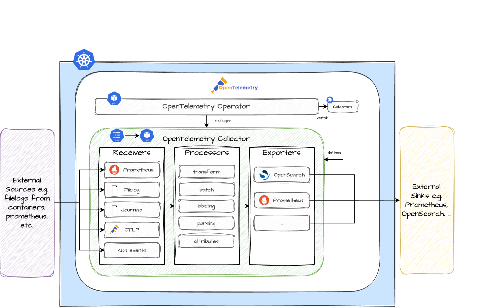

Learn more about the **Logs Operator** Plugin. In combination with the [**Logs Plugin**](https://github.com/cloudoperators/greenhouse-extensions/tree/07d9d58378a95d3f85c00e15651ae23c20479951/logs) it enables the ingestion, collection and export of telemetry signals (logs and metrics) for your Greenhouse cluster. If you already have a running OpenTelemetry Operator in your cluster you can skip this step and directly install the **Logs Plugin**.

The main terminologies used in this document can be found in [core-concepts](https://cloudoperators.github.io/greenhouse/docs/getting-started/core-concepts).

## Overview

OpenTelemetry is an observability framework and toolkit for creating and managing telemetry data such as metrics, logs and traces. Unlike other observability tools, OpenTelemetry is vendor and tool agnostic, meaning it can be used with a variety of observability backends, including open source tools such as _OpenSearch_ and _Prometheus_.

The focus of the Plugin is to provide easy-to-use configurations for common use cases of receiving, processing and exporting telemetry data in Kubernetes. The storage and visualization of the same is intentionally left to other tools.

Components included in this Plugin:

- [Operator](https://opentelemetry.io/docs/kubernetes/operator/)

## Architecture

## Note

It is the intention to add more configuration over time and contributions of your very own configuration is highly appreciated. If you discover bugs or want to add functionality to the Plugin, feel free to create a pull request.

## Quick Start

This guide provides a quick and straightforward way to use the **OpenTelemetry Operator** for Logs as a Greenhouse Plugin on your Kubernetes cluster.

**Prerequisites**

- A running and Greenhouse-onboarded Kubernetes cluster. If you don't have one, follow the [Cluster onboarding](https://cloudoperators.github.io/greenhouse/docs/user-guides/cluster/onboarding) guide.
- We recommend a running cert-manager in the cluster before installing the **Logs Operator** Plugin

**Step 1:**

You can install the `logs-operator` package in your cluster by installing it with [Helm](https://helm.sh/docs/helm/helm_install) manually or let the Greenhouse platform lifecycle do it for you automatically. For the latter, you can either:
  1. Go to Greenhouse dashboard and select the **Logs Operator** Plugin from the catalog. Specify the cluster and required option values.
  2. Create and specify a `Plugin` resource in your Greenhouse central cluster according to the [examples](#examples).

**Step 2:**

The package will deploy the OpenTelemetry Operator which works as a manager for the collectors and auto-instrumentation of the workload. The package does only include the Operator. For ingesting, exporting and collecting telemetry signals from sources you will also need the **Logs Operator Plugin**.

**Step 3:**

Greenhouse regularly performs integration tests that are bundled with the **Logs Operator** Plugin. These provide feedback on whether all the necessary resources are installed and continuously up and running. You will find messages about this in the Plugin status and also in the Greenhouse dashboard.

## Values

| Key | Type | Default | Description |
|-----|------|---------|-------------|
| commonLabels | object | `{}` | common labels to apply to all resources. |
| openTelemetry.prometheus.additionalLabels | object | `{}` | Label selectors for the Prometheus resources to be picked up by prometheus-operator. |
| openTelemetry.prometheus.podMonitor | object | `{"enabled":true}` | Activates the pod-monitoring for the Logs Collector. |
| openTelemetry.prometheus.rules | object | `{"additionalRuleLabels":null,"annotations":{},"create":true,"enabled":["ReconcileErrors","WorkqueueDepth"],"labels":{}}` | Default rules for monitoring the opentelemetry components. |
| openTelemetry.prometheus.rules.additionalRuleLabels | string | `nil` | Additional labels for PrometheusRule alerts. |
| openTelemetry.prometheus.rules.annotations | object | `{}` | Annotations for PrometheusRules. |
| openTelemetry.prometheus.rules.create | bool | `true` | Enables PrometheusRule resources to be created. |
| openTelemetry.prometheus.rules.enabled | list | `["ReconcileErrors","WorkqueueDepth"]` | PrometheusRules to enable. |
| openTelemetry.prometheus.rules.labels | object | `{}` | Labels for PrometheusRules. |
| openTelemetry.prometheus.serviceMonitor | object | `{"enabled":true}` | Activates the service-monitoring for the Logs Collector. |
| opentelemetry-operator.admissionWebhooks.autoGenerateCert | object | `{"recreate":false}` | Activate to use Helm to create self-signed certificates. |
| opentelemetry-operator.admissionWebhooks.autoGenerateCert.recreate | bool | `false` | Activate to recreate the cert after a defined period (certPeriodDays default is 365). |
| opentelemetry-operator.admissionWebhooks.certManager | object | `{"enabled":false}` | Activate to use the CertManager for generating self-signed certificates. |
| opentelemetry-operator.admissionWebhooks.failurePolicy | string | `"Ignore"` | Defines if the admission webhooks should `Ignore` errors or `Fail` on errors when communicating with the API server. |
| opentelemetry-operator.crds.create | bool | `true` |  |
| opentelemetry-operator.kubeRBACProxy | object | `{"enabled":false}` | the kubeRBACProxy can be enabled to allow the operator perform RBAC authorization against the Kubernetes API. |
| opentelemetry-operator.manager.collectorImage.repository | string | `"ghcr.io/cloudoperators/opentelemetry-collector-contrib"` | overrides the default image repository for the OpenTelemetry Collector image. |
| opentelemetry-operator.manager.collectorImage.tag | string | `"2016982"` | overrides the default image tag for the OpenTelemetry Collector image. |
| opentelemetry-operator.manager.image.repository | string | `"ghcr.io/open-telemetry/opentelemetry-operator/opentelemetry-operator"` | overrides the default image repository for the OpenTelemetry Operator image. |
| opentelemetry-operator.manager.image.tag | string | `"v0.131.0"` | overrides the default tag repository for the OpenTelemetry Operator image. |
| opentelemetry-operator.manager.serviceMonitor.enabled | bool | `true` | Enable serviceMonitor for Prometheus metrics scrape |
| opentelemetry-operator.manager.serviceMonitor.extraLabels | object | `{}` | Additional labels on the ServiceMonitor |
| opentelemetry-operator.nameOverride | string | `"operator"` | Provide a name in place of the default name `opentelemetry-operator`. |
| testFramework.enabled | bool | `true` | Activates the Helm chart testing framework. |
| testFramework.image.registry | string | `"ghcr.io"` | Defines the image registry for the test framework. |
| testFramework.image.repository | string | `"cloudoperators/greenhouse-extensions-integration-test"` | Defines the image repository for the test framework. |
| testFramework.image.tag | string | `"main"` | Defines the image tag for the test framework. |
| testFramework.imagePullPolicy | string | `"IfNotPresent"` | Defines the image pull policy for the test framework. |

### Examples

TBD
