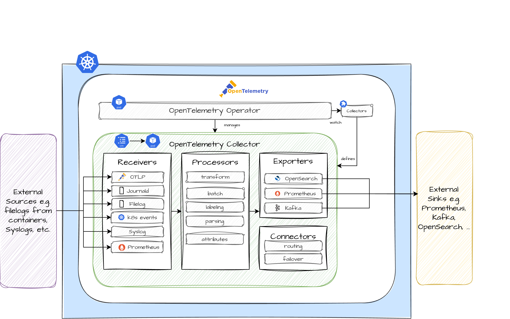

Learn more about the **Logs** Plugin. Use it to enable the ingestion, collection and export of telemetry signals (logs and metrics) for your Greenhouse cluster.

The main terminologies used in this document can be found in [core-concepts](https://cloudoperators.github.io/greenhouse/docs/getting-started/core-concepts).

## Overview

OpenTelemetry is an observability framework and toolkit for creating and managing telemetry data such as metrics, logs and traces. Unlike other observability tools, OpenTelemetry is vendor and tool agnostic, meaning it can be used with a variety of observability backends, including open source tools such as _OpenSearch_ and _Prometheus_.

The focus of the Plugin is to provide easy-to-use configurations for common use cases of receiving, processing and exporting telemetry data in Kubernetes. The storage and visualization of the same is intentionally left to other tools.

Components included in this Plugin:

- [Operator](https://opentelemetry.io/docs/kubernetes/operator/)
- [Collector](https://github.com/open-telemetry/opentelemetry-collector)
- [Receivers](https://github.com/open-telemetry/opentelemetry-collector/blob/main/receiver/README.md)
    - [Filelog Receiver](https://github.com/open-telemetry/opentelemetry-collector-contrib/tree/main/receiver/filelogreceiver)
    - [k8sevents Receiver](https://github.com/open-telemetry/opentelemetry-collector-contrib/tree/main/receiver/k8seventsreceiver)
    - [journald Receiver](https://github.com/open-telemetry/opentelemetry-collector-contrib/tree/main/receiver/journaldreceiver)
    - [prometheus/internal](https://opentelemetry.io/docs/collector/internal-telemetry/)
- [Connector](https://opentelemetry.io/docs/collector/building/connector/)
- [OpenSearch Exporter](https://github.com/open-telemetry/opentelemetry-collector-contrib/tree/main/exporter/opensearchexporter)

## Architecture

## Note

It is the intention to add more configuration over time and contributions of your very own configuration is highly appreciated. If you discover bugs or want to add functionality to the Plugin, feel free to create a pull request.

## Quick Start

This guide provides a quick and straightforward way to use **OpenTelemetry** for Logs as a Greenhouse Plugin on your Kubernetes cluster.

**Prerequisites**

- A running and Greenhouse-onboarded Kubernetes cluster. If you don't have one, follow the [Cluster onboarding](https://cloudoperators.github.io/greenhouse/docs/user-guides/cluster/onboarding) guide.
- For logs, a OpenSearch instance to store. If you don't have one, reach out to your observability team to get access to one.
- We recommend a running cert-manager in the cluster before installing the **Logs** Plugin
- To gather metrics, you **must** have a Prometheus instance in the onboarded cluster for storage and for managing Prometheus specific CRDs. If you don not have an instance, install the [kube-monitoring](https://cloudoperators.github.io/greenhouse/docs/reference/catalog/kube-monitoring) Plugin first.

**Step 1:**

You can install the `Logs` package in your cluster by installing it with [Helm](https://helm.sh/docs/helm/helm_install) manually or let the Greenhouse platform lifecycle do it for you automatically. For the latter, you can either:
  1. Go to Greenhouse dashboard and select the **Logs** Plugin from the catalog. Specify the cluster and required option values.
  2. Create and specify a `Plugin` resource in your Greenhouse central cluster according to the [examples](#examples).

**Step 2:**

The package will deploy the OpenTelemetry Operator which works as a manager for the collectors and auto-instrumentation of the workload. By default, the package will include a configuration for collecting metrics and logs. The log-collector is currently processing data from the [preconfigured receivers](#Overview):
- Files via the Filelog Receiver
- Kubernetes Events from the Kubernetes API server
- Journald events from systemd journal
- its own metrics

You can disable the collection of logs by setting `openTelemetry.logCollector.enabled` to `false`. The same is true for disabling the collection of metrics by setting `openTelemetry.metricsCollector.enabled` to `false`.
The `logsCollector` comes with a standard set of log-processing, such as adding cluster information and common labels for Journald events.
In addition we provide default pipelines for common log types. Currently the following log types have default configurations that can be enabled (requires `logsCollector.enabled` to `true`):
  1. KVM: `openTelemetry.logsCollector.kvmConfig`: Logs from Kernel-based Virtual Machines (KVMs) providing insights into virtualization activities, resource usage, and system performance
  2. Ceph:`openTelemetry.logsCollector.cephConfig`: Logs from Ceph storage systems, capturing information about cluster operations, performance metrics, and health status
 
These default configurations provide common labels and Grok parsing for logs emitted through the respective services.

Based on the backend selection the telemetry data will be exporter to the backend.

**Step 3:**

Greenhouse regularly performs integration tests that are bundled with the **Logs** Plugin. These provide feedback on whether all the necessary resources are installed and continuously up and running. You will find messages about this in the Plugin status and also in the Greenhouse dashboard.

## Failover Connector

The **Logs** Plugin comes with a [Failover Connector](https://github.com/open-telemetry/opentelemetry-collector-contrib/tree/main/connector/failoverconnector) for OpenSearch for two users. The connector will periodically try to establish a stable connection for the prefered user (`failover_username_a`) and in case of a failed try, the connector will try to establish a connection with the fallback user (`failover_username_b`). This feature can be used to secure the shipping of logs in case of expiring credentials or password rotation.

## Values

| Key | Type | Default | Description |
|-----|------|---------|-------------|
| commonLabels | object | `{}` | common labels to apply to all resources. |
| openTelemetry.cluster | string | `nil` | Cluster label for Logging |
| openTelemetry.customLabels | object | `{}` | custom Labels applied to servicemonitor, secrets and collectors |
| openTelemetry.logsCollector.cephConfig | object | `{"enabled":false}` | Activates the configuration for Ceph logs (requires logsCollector to be enabled). |
| openTelemetry.logsCollector.enabled | bool | `true` | Activates the standard configuration for Logs. |
| openTelemetry.logsCollector.failover | object | `{"enabled":true}` | Activates the failover mechanism for shipping logs using the failover_username_band failover_password_b credentials in case the credentials failover_username_a and failover_password_a have expired. |
| openTelemetry.logsCollector.kvmConfig | object | `{"enabled":false}` | Activates the configuration for KVM logs (requires logsCollector to be enabled). |
| openTelemetry.metricsCollector | object | `{"enabled":false}` | Activates the standard configuration for metrics. |
| openTelemetry.openSearchLogs.endpoint | string | `nil` | Endpoint URL for OpenSearch |
| openTelemetry.openSearchLogs.failover_password_a | string | `nil` | Password for OpenSearch endpoint |
| openTelemetry.openSearchLogs.failover_password_b | string | `nil` | Second Password (as a failover) for OpenSearch endpoint |
| openTelemetry.openSearchLogs.failover_username_a | string | `nil` | Username for OpenSearch endpoint |
| openTelemetry.openSearchLogs.failover_username_b | string | `nil` | Second Username (as a failover) for OpenSearch endpoint |
| openTelemetry.openSearchLogs.index | string | `nil` | Name for OpenSearch index |
| openTelemetry.prometheus.additionalLabels | object | `{}` | Label selectors for the Prometheus resources to be picked up by prometheus-operator. |
| openTelemetry.prometheus.podMonitor | object | `{"enabled":true}` | Activates the pod-monitoring for the Logs Collector. |
| openTelemetry.prometheus.rules | object | `{"additionalRuleLabels":null,"annotations":{},"create":true,"disabled":["ReconcileErrors","WorkqueueDepth","ReceiverRefusedMetric"],"labels":{}}` | Default rules for monitoring the opentelemetry components. |
| openTelemetry.prometheus.rules.additionalRuleLabels | string | `nil` | Additional labels for PrometheusRule alerts. |
| openTelemetry.prometheus.rules.annotations | object | `{}` | Annotations for PrometheusRules. |
| openTelemetry.prometheus.rules.create | bool | `true` | Enables PrometheusRule resources to be created. |
| openTelemetry.prometheus.rules.disabled | list | `["ReconcileErrors","WorkqueueDepth","ReceiverRefusedMetric"]` | PrometheusRules to disable. |
| openTelemetry.prometheus.rules.labels | object | `{}` | Labels for PrometheusRules. |
| openTelemetry.prometheus.serviceMonitor | object | `{"enabled":true}` | Activates the service-monitoring for the Logs Collector. |
| openTelemetry.region | string | `nil` | Region label for Logging |
| opentelemetry-operator.admissionWebhooks.autoGenerateCert | object | `{"recreate":false}` | Activate to use Helm to create self-signed certificates. |
| opentelemetry-operator.admissionWebhooks.autoGenerateCert.recreate | bool | `false` | Activate to recreate the cert after a defined period (certPeriodDays default is 365). |
| opentelemetry-operator.admissionWebhooks.certManager | object | `{"enabled":false}` | Activate to use the CertManager for generating self-signed certificates. |
| opentelemetry-operator.admissionWebhooks.failurePolicy | string | `"Ignore"` | Defines if the admission webhooks should `Ignore` errors or `Fail` on errors when communicating with the API server. |
| opentelemetry-operator.crds.create | bool | `false` | The required CRDs used by this dependency are version-controlled in this repository under ./crds. If you want to use the upstream CRDs, set this variable to `true``. |
| opentelemetry-operator.kubeRBACProxy | object | `{"enabled":false}` | the kubeRBACProxy can be enabled to allow the operator perform RBAC authorization against the Kubernetes API. |
| opentelemetry-operator.manager.collectorImage.repository | string | `"ghcr.io/cloudoperators/opentelemetry-collector-contrib"` | overrides the default image repository for the OpenTelemetry Collector image. |
| opentelemetry-operator.manager.collectorImage.tag | string | `"2016982"` | overrides the default image tag for the OpenTelemetry Collector image. |
| opentelemetry-operator.manager.image.repository | string | `"ghcr.io/open-telemetry/opentelemetry-operator/opentelemetry-operator"` | overrides the default image repository for the OpenTelemetry Operator image. |
| opentelemetry-operator.manager.image.tag | string | `"v0.131.0"` | overrides the default tag repository for the OpenTelemetry Operator image. |
| opentelemetry-operator.manager.serviceMonitor | object | `{"enabled":true}` | Enable serviceMonitor for Prometheus metrics scrape |
| opentelemetry-operator.nameOverride | string | `"operator"` | Provide a name in place of the default name `opentelemetry-operator`. |
| testFramework.enabled | bool | `true` | Activates the Helm chart testing framework. |
| testFramework.image.registry | string | `"ghcr.io"` | Defines the image registry for the test framework. |
| testFramework.image.repository | string | `"cloudoperators/greenhouse-extensions-integration-test"` | Defines the image repository for the test framework. |
| testFramework.image.tag | string | `"main"` | Defines the image tag for the test framework. |
| testFramework.imagePullPolicy | string | `"IfNotPresent"` | Defines the image pull policy for the test framework. |

### Examples

TBD
