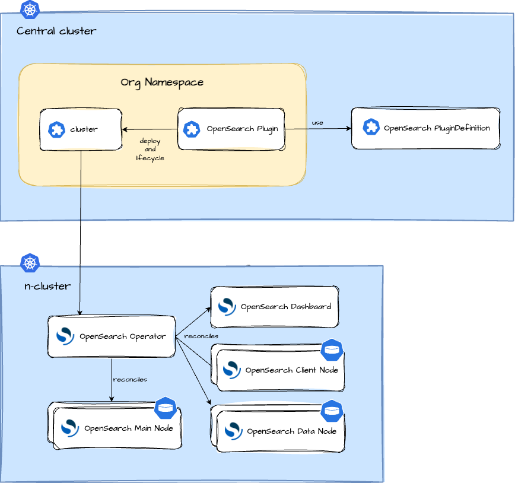

## OpenSearch Plugin

The **OpenSearch** plugin sets up an OpenSearch environment using the **OpenSearch Operator**, automating deployment, provisioning, management, and orchestration of OpenSearch clusters and dashboards. It functions as the backend for logs gathered by collectors such as OpenTelemetry collectors, enabling storage and visualization of logs for Greenhouse-onboarded Kubernetes clusters.

The main terminologies used in this document can be found in [core-concepts](https://cloudoperators.github.io/greenhouse/docs/getting-started/core-concepts).

## Overview

OpenSearch is a distributed search and analytics engine designed for real-time log and event data analysis.
The **OpenSearch Operator** simplifies the management of OpenSearch clusters by providing declarative APIs for configuration and scaling.

### Components included in this Plugin:

- [OpenSearch Operator](https://github.com/opensearch-project/opensearch-k8s-operator)
- OpenSearch Cluster Management
- OpenSearch Dashboards Deployment
- OpenSearch Index Management
- OpenSearch Security Configuration

## Architecture



The OpenSearch Operator automates the management of OpenSearch clusters within a Kubernetes environment. The architecture consists of:

- **OpenSearchCluster CRD**: Defines the structure and configuration of OpenSearch clusters, including node roles, scaling policies, and version management.
- **OpenSearchDashboards CRD**: Manages OpenSearch Dashboards deployments, ensuring high availability and automatic upgrades.
- **OpenSearchISMPolicy CRD**: Implements index lifecycle management, defining policies for retention, rollover, and deletion.
- **OpenSearchIndexTemplate CRD**: Enables the definition of index mappings, settings, and template structures.
- **Security Configuration via OpenSearchRole and OpenSearchUser**: Manages authentication and authorization for OpenSearch users and roles.

## Note

More configurations will be added over time, and contributions of custom configurations are highly appreciated.
If you discover bugs or want to add functionality to the plugin, feel free to create a pull request.

## Quick Start

This guide provides a quick and straightforward way to use **OpenSearch** as a Greenhouse Plugin on your Kubernetes cluster.

### Prerequisites

- A running and Greenhouse-onboarded Kubernetes cluster. If you don't have one, follow the [Cluster onboarding](https://cloudoperators.github.io/greenhouse/docs/user-guides/cluster/onboarding) guide.
- The OpenSearch Operator installed via Helm or Kubernetes manifests.
- An OpenTelemetry or similar log ingestion pipeline configured to send logs to OpenSearch.

### Installation

#### Install via Greenhouse

1. Navigate to the **Greenhouse Dashboard**.
2. Select the **OpenSearch** plugin from the catalog.
3. Specify the target cluster and configuration options.

## Values

| Key | Type | Default | Description |
|-----|------|---------|-------------|
| certManager.defaults.durations.ca | string | `"8760h"` | Validity period for CA certificates (1 year) |
| certManager.defaults.durations.leaf | string | `"4800h"` | Validity period for leaf certificates (200 days to comply with CA/B Forum baseline requirements) |
| certManager.defaults.privateKey.algorithm | string | `"RSA"` | Algorithm used for generating private keys |
| certManager.defaults.privateKey.encoding | string | `"PKCS8"` | Encoding format for private keys (PKCS8 recommended) |
| certManager.defaults.privateKey.size | int | `2048` | Key size in bits for RSA keys |
| certManager.defaults.usages | list | `["digital signature","key encipherment","server auth","client auth"]` | List of extended key usages for certificates |
| certManager.enable | bool | `true` | Enable cert-manager integration for issuing TLS certificates |
| certManager.httpDnsNames | list | `["opensearch-client.tld"]` | Override HTTP DNS names for OpenSearch client endpoints |
| certManager.issuer.ca | object | `{"name":"opensearch-ca-issuer"}` | Name of the CA Issuer to be used for internal certs |
| certManager.issuer.digicert | object | `{"group":"certmanager.cloud.sap","kind":"DigicertIssuer","name":"digicert-issuer"}` | API group for the DigicertIssuer custom resource |
| certManager.issuer.selfSigned | object | `{"name":"opensearch-issuer"}` | Name of the self-signed issuer used to sign the internal CA certificate |
| cluster.actionGroups | list | `[]` | List of OpensearchActionGroup. Check values.yaml file for examples. |
| cluster.cluster.annotations | object | `{}` | OpenSearchCluster annotations |
| cluster.cluster.bootstrap.additionalConfig | object | `{}` | bootstrap additional configuration, key-value pairs that will be added to the opensearch.yml configuration |
| cluster.cluster.bootstrap.affinity | object | `{}` | bootstrap pod affinity rules |
| cluster.cluster.bootstrap.jvm | string | `""` | bootstrap pod jvm options. If jvm is not provided then the java heap size will be set to half of resources.requests.memory which is the recommend value for data nodes. If jvm is not provided and resources.requests.memory does not exist then value will be -Xmx512M -Xms512M |
| cluster.cluster.bootstrap.nodeSelector | object | `{}` | bootstrap pod node selectors |
| cluster.cluster.bootstrap.resources | object | `{}` | bootstrap pod cpu and memory resources |
| cluster.cluster.bootstrap.tolerations | list | `[]` | bootstrap pod tolerations |
| cluster.cluster.client.service.annotations | object | `{}` | Annotations to add to the service, e.g. disco. |
| cluster.cluster.client.service.enabled | bool | `true` | Enable or disable the external client service. |
| cluster.cluster.client.service.externalIPs | list | `[]` | List of external IPs to expose the service on. |
| cluster.cluster.client.service.loadBalancerSourceRanges | list | `[]` | List of allowed IP ranges for external access when service type is `LoadBalancer`. |
| cluster.cluster.client.service.ports | list | `[{"name":"http","port":9200,"protocol":"TCP","targetPort":9200}]` | Ports to expose for the client service. |
| cluster.cluster.client.service.type | string | `"ClusterIP"` | Kubernetes service type. Defaults to `ClusterIP`, but should be set to `LoadBalancer` to expose OpenSearch client nodes externally. |
| cluster.cluster.confMgmt.smartScaler | bool | `true` | Enable nodes to be safely removed from the cluster |
| cluster.cluster.dashboards.additionalConfig | object | `{}` | Additional properties for opensearch_dashboards.yaml |
| cluster.cluster.dashboards.affinity | object | `{}` | dashboards pod affinity rules |
| cluster.cluster.dashboards.annotations | object | `{}` | dashboards annotations |
| cluster.cluster.dashboards.basePath | string | `""` | dashboards Base Path for Opensearch Clusters running behind a reverse proxy |
| cluster.cluster.dashboards.enable | bool | `true` | Enable dashboards deployment |
| cluster.cluster.dashboards.env | list | `[]` | dashboards pod env variables |
| cluster.cluster.dashboards.image | string | `"docker.io/opensearchproject/opensearch-dashboards"` | dashboards image |
| cluster.cluster.dashboards.imagePullPolicy | string | `"IfNotPresent"` | dashboards image pull policy |
| cluster.cluster.dashboards.imagePullSecrets | list | `[]` | dashboards image pull secrets |
| cluster.cluster.dashboards.labels | object | `{}` | dashboards labels |
| cluster.cluster.dashboards.nodeSelector | object | `{}` | dashboards pod node selectors |
| cluster.cluster.dashboards.opensearchCredentialsSecret | object | `{}` | Secret that contains fields username and password for dashboards to use to login to opensearch, must only be supplied if a custom securityconfig is provided |
| cluster.cluster.dashboards.pluginsList | list | `[]` | List of dashboards plugins to install |
| cluster.cluster.dashboards.podSecurityContext | object | `{}` | dasboards pod security context configuration |
| cluster.cluster.dashboards.replicas | int | `1` | number of dashboards replicas |
| cluster.cluster.dashboards.resources | object | `{}` | dashboards pod cpu and memory resources |
| cluster.cluster.dashboards.securityContext | object | `{}` | dashboards security context configuration |
| cluster.cluster.dashboards.service.loadBalancerSourceRanges | list | `[]` | source ranges for a loadbalancer |
| cluster.cluster.dashboards.service.type | string | `"ClusterIP"` | dashboards service type |
| cluster.cluster.dashboards.tls.caSecret | object | `{"name":"opensearch-ca-cert"}` | Secret that contains the ca certificate as ca.crt. If this and generate=true is set the existing CA cert from that secret is used to generate the node certs. In this case must contain ca.crt and ca.key fields |
| cluster.cluster.dashboards.tls.enable | bool | `false` | Enable HTTPS for dashboards |
| cluster.cluster.dashboards.tls.generate | bool | `false` | generate certificate, if false secret must be provided |
| cluster.cluster.dashboards.tls.secret | object | `{"name":"opensearch-http-cert"}` | Optional, name of a TLS secret that contains ca.crt, tls.key and tls.crt data. If ca.crt is in a different secret provide it via the caSecret field |
| cluster.cluster.dashboards.tolerations | list | `[]` | dashboards pod tolerations |
| cluster.cluster.dashboards.version | string | `"2.19.1"` | dashboards version |
| cluster.cluster.general.additionalConfig | object | `{}` | Extra items to add to the opensearch.yml |
| cluster.cluster.general.additionalVolumes | list | `[]` | Additional volumes to mount to all pods in the cluster. Supported volume types configMap, emptyDir, secret (with default Kubernetes configuration schema) |
| cluster.cluster.general.drainDataNodes | bool | `true` | Controls whether to drain data notes on rolling restart operations |
| cluster.cluster.general.httpPort | int | `9200` | Opensearch service http port |
| cluster.cluster.general.image | string | `"docker.io/opensearchproject/opensearch"` | Opensearch image |
| cluster.cluster.general.imagePullPolicy | string | `"IfNotPresent"` | Default image pull policy |
| cluster.cluster.general.keystore | list | `[]` | Populate opensearch keystore before startup |
| cluster.cluster.general.monitoring.enable | bool | `true` | Enable cluster monitoring |
| cluster.cluster.general.monitoring.labels | object | `{}` | ServiceMonitor labels |
| cluster.cluster.general.monitoring.monitoringUserSecret | string | `""` | Secret with 'username' and 'password' keys for monitoring user. You could also use OpenSearchUser CRD instead of setting it. |
| cluster.cluster.general.monitoring.pluginUrl | string | `"https://github.com/Virtimo/prometheus-exporter-plugin-for-opensearch/releases/download/v2.19.1/prometheus-exporter-2.19.1.0.zip"` | Custom URL for the monitoring plugin |
| cluster.cluster.general.monitoring.scrapeInterval | string | `"30s"` | How often to scrape metrics |
| cluster.cluster.general.monitoring.tlsConfig | object | `{"insecureSkipVerify":true}` | Override the tlsConfig of the generated ServiceMonitor |
| cluster.cluster.general.pluginsList | list | `[]` | List of Opensearch plugins to install |
| cluster.cluster.general.podSecurityContext | object | `{}` | Opensearch pod security context configuration |
| cluster.cluster.general.securityContext | object | `{}` | Opensearch securityContext |
| cluster.cluster.general.serviceAccount | string | `""` | Opensearch serviceAccount name. If Service Account doesn't exist it could be created by setting `serviceAccount.create` and `serviceAccount.name` |
| cluster.cluster.general.serviceName | string | `""` | Opensearch service name |
| cluster.cluster.general.setVMMaxMapCount | bool | `true` | Enable setVMMaxMapCount. OpenSearch requires the Linux kernel vm.max_map_count option to be set to at least 262144 |
| cluster.cluster.general.snapshotRepositories | list | `[]` | Opensearch snapshot repositories configuration |
| cluster.cluster.general.vendor | string | `"Opensearch"` |  |
| cluster.cluster.general.version | string | `"2.19.1"` | Opensearch version |
| cluster.cluster.ingress.dashboards.annotations | object | `{}` | dashboards ingress annotations |
| cluster.cluster.ingress.dashboards.className | string | `""` | Ingress class name |
| cluster.cluster.ingress.dashboards.enabled | bool | `false` | Enable ingress for dashboards service |
| cluster.cluster.ingress.dashboards.hosts | list | `[]` | Ingress hostnames |
| cluster.cluster.ingress.dashboards.tls | list | `[]` | Ingress tls configuration |
| cluster.cluster.ingress.opensearch.annotations | object | `{}` | Opensearch ingress annotations |
| cluster.cluster.ingress.opensearch.className | string | `""` | Opensearch Ingress class name |
| cluster.cluster.ingress.opensearch.enabled | bool | `false` | Enable ingress for Opensearch service |
| cluster.cluster.ingress.opensearch.hosts | list | `[]` | Opensearch Ingress hostnames |
| cluster.cluster.ingress.opensearch.tls | list | `[]` | Opensearch tls configuration |
| cluster.cluster.initHelper.imagePullPolicy | string | `"IfNotPresent"` | initHelper image pull policy |
| cluster.cluster.initHelper.imagePullSecrets | list | `[]` | initHelper image pull secret |
| cluster.cluster.initHelper.resources | object | `{}` | initHelper pod cpu and memory resources |
| cluster.cluster.initHelper.version | string | `"1.36"` | initHelper version |
| cluster.cluster.labels | object | `{}` | OpenSearchCluster labels |
| cluster.cluster.name | string | `""` | OpenSearchCluster name, by default release name is used |
| cluster.cluster.nodePools | list | `[{"component":"main","diskSize":"30Gi","replicas":3,"resources":{"limits":{"cpu":"500m","memory":"1Gi"},"requests":{"cpu":"500m","memory":"1Gi"}},"roles":["cluster_manager"]},{"component":"data","diskSize":"30Gi","replicas":1,"resources":{"limits":{"cpu":"500m","memory":"1Gi"},"requests":{"cpu":"500m","memory":"1Gi"}},"roles":["data"]},{"component":"client","diskSize":"30Gi","replicas":1,"resources":{"limits":{"cpu":"500m","memory":"1Gi"},"requests":{"cpu":"500m","memory":"1Gi"}},"roles":["client"]}]` | Opensearch nodes configuration |
| cluster.cluster.security.config.adminCredentialsSecret | object | `{}` | Secret that contains fields username and password to be used by the operator to access the opensearch cluster for node draining. Must be set if custom securityconfig is provided. |
| cluster.cluster.security.config.adminSecret | object | `{"name":"opensearch-admin-cert"}` | TLS Secret that contains a client certificate (tls.key, tls.crt, ca.crt) with admin rights in the opensearch cluster. Must be set if transport certificates are provided by user and not generated |
| cluster.cluster.security.config.securityConfigSecret | object | `{}` | Secret that contains the differnt yml files of the opensearch-security config (config.yml, internal_users.yml, etc) |
| cluster.cluster.security.tls.http.caSecret | object | `{}` | Optional, secret that contains the ca certificate as ca.crt. If this and generate=true is set the existing CA cert from that secret is used to generate the node certs. In this case must contain ca.crt and ca.key fields |
| cluster.cluster.security.tls.http.generate | bool | `false` | If set to true the operator will generate a CA and certificates for the cluster to use, if false - secrets with existing certificates must be supplied |
| cluster.cluster.security.tls.http.secret | object | `{"name":"opensearch-admin-cert"}` | Optional, name of a TLS secret that contains ca.crt, tls.key and tls.crt data. If ca.crt is in a different secret provide it via the caSecret field |
| cluster.cluster.security.tls.transport.adminDn | list | `["CN=admin"]` | DNs of certificates that should have admin access, mainly used for securityconfig updates via securityadmin.sh, only used when existing certificates are provided |
| cluster.cluster.security.tls.transport.caSecret | object | `{"name":"opensearch-ca-cert"}` | Optional, secret that contains the ca certificate as ca.crt. If this and generate=true is set the existing CA cert from that secret is used to generate the node certs. In this case must contain ca.crt and ca.key fields |
| cluster.cluster.security.tls.transport.generate | bool | `false` | If set to true the operator will generate a CA and certificates for the cluster to use, if false secrets with existing certificates must be supplied |
| cluster.cluster.security.tls.transport.nodesDn | list | `["CN=opensearch-transport"]` | Allowed Certificate DNs for nodes, only used when existing certificates are provided |
| cluster.cluster.security.tls.transport.perNode | bool | `false` | Separate certificate per node |
| cluster.cluster.security.tls.transport.secret | object | `{"name":"opensearch-transport-cert"}` | Optional, name of a TLS secret that contains ca.crt, tls.key and tls.crt data. If ca.crt is in a different secret provide it via the caSecret field |
| cluster.componentTemplates | list | `[]` | List of OpensearchComponentTemplate. Check values.yaml file for examples. |
| cluster.fullnameOverride | string | `""` |  |
| cluster.indexTemplates | list | `[]` | List of OpensearchIndexTemplate. Check values.yaml file for examples. |
| cluster.indexTemplatesWorkAround | list | `[{"dataStream":{"timestamp_field":{"name":"@timestamp"}},"indexPatterns":["logs*"],"name":"logs-index-template","priority":100,"templateSpec":{"mappings":{"properties":{"@timestamp":{"type":"date"},"message":{"type":"text"}}},"settings":{"index":{"number_of_replicas":1,"number_of_shards":1,"refresh_interval":"1s"}}}}]` | List of OpensearchIndexTemplate. Check values.yaml file for examples. |
| cluster.ismPolicies | list | `[{"defaultState":"hot","description":"Policy to rollover logs after 7d, 30GB or 50M docs and delete after 30d","ismTemplate":{"indexPatterns":["logs*"],"priority":100},"name":"logs-rollover-policy","states":[{"actions":[{"rollover":{"minDocCount":50000000,"minIndexAge":"7d","minSize":"30gb"}}],"name":"hot","transitions":[{"conditions":{"minIndexAge":"30d"},"stateName":"delete"}]},{"actions":[{"delete":{}}],"name":"delete","transitions":[]}]}]` | List of OpenSearchISMPolicy. Check values.yaml file for examples. |
| cluster.nameOverride | string | `""` |  |
| cluster.roles | list | `[{"clusterPermissions":["cluster_monitor","cluster_composite_ops","cluster:admin/ingest/pipeline/put","cluster:admin/ingest/pipeline/get","indices:admin/template/get","cluster_manage_index_templates"],"indexPermissions":[{"allowedActions":["indices:admin/template/get","indices:admin/template/put","indices:admin/mapping/put","indices:admin/create","indices:data/write/bulk*","indices:data/write/index","indices:data/read*","indices:monitor*","indices_all"],"indexPatterns":["logs*"]}],"name":"logs-role"}]` | List of OpensearchRole. Check values.yaml file for examples. |
| cluster.serviceAccount.annotations | object | `{}` | Service Account annotations |
| cluster.serviceAccount.create | bool | `false` | Create Service Account |
| cluster.serviceAccount.name | string | `""` | Service Account name. Set `general.serviceAccount` to use this Service Account for the Opensearch cluster |
| cluster.tenants | list | `[]` | List of additional tenants. Check values.yaml file for examples. |
| cluster.users | list | `[{"backendRoles":[],"name":"logs","opendistroSecurityRoles":["logs-role"],"secretKey":"password","secretName":"logs-credentials"},{"backendRoles":[],"name":"logs2","opendistroSecurityRoles":["logs-role"],"secretKey":"password","secretName":"logs2-credentials"}]` | List of OpenSearch user configurations. Each user references a secret (defined in usersCredentials) for authentication. |
| cluster.usersCredentials | object | `{"logs":{"password":"","username":""},"logs2":{"password":"","username":""}}` | List of OpenSearch user credentials. These credentials are used for authenticating users with OpenSearch. |
| cluster.usersRoleBinding | list | `[{"name":"logs-access","roles":["logs-role"],"users":["logs"]}]` | Allows to link any number of users, backend roles and roles with a OpensearchUserRoleBinding. Each user in the binding will be granted each role Check values.yaml file for examples. |
| operator.fullnameOverride | string | `"opensearch-operator"` |  |
| operator.installCRDs | bool | `false` |  |
| operator.kubeRbacProxy.enable | bool | `true` |  |
| operator.kubeRbacProxy.image.repository | string | `"quay.io/brancz/kube-rbac-proxy"` |  |
| operator.kubeRbacProxy.image.tag | string | `"v0.19.1"` |  |
| operator.kubeRbacProxy.livenessProbe.failureThreshold | int | `3` |  |
| operator.kubeRbacProxy.livenessProbe.httpGet.path | string | `"/healthz"` |  |
| operator.kubeRbacProxy.livenessProbe.httpGet.port | int | `10443` |  |
| operator.kubeRbacProxy.livenessProbe.httpGet.scheme | string | `"HTTPS"` |  |
| operator.kubeRbacProxy.livenessProbe.initialDelaySeconds | int | `10` |  |
| operator.kubeRbacProxy.livenessProbe.periodSeconds | int | `15` |  |
| operator.kubeRbacProxy.livenessProbe.successThreshold | int | `1` |  |
| operator.kubeRbacProxy.livenessProbe.timeoutSeconds | int | `3` |  |
| operator.kubeRbacProxy.readinessProbe.failureThreshold | int | `3` |  |
| operator.kubeRbacProxy.readinessProbe.httpGet.path | string | `"/healthz"` |  |
| operator.kubeRbacProxy.readinessProbe.httpGet.port | int | `10443` |  |
| operator.kubeRbacProxy.readinessProbe.httpGet.scheme | string | `"HTTPS"` |  |
| operator.kubeRbacProxy.readinessProbe.initialDelaySeconds | int | `10` |  |
| operator.kubeRbacProxy.readinessProbe.periodSeconds | int | `15` |  |
| operator.kubeRbacProxy.readinessProbe.successThreshold | int | `1` |  |
| operator.kubeRbacProxy.readinessProbe.timeoutSeconds | int | `3` |  |
| operator.kubeRbacProxy.resources.limits.cpu | string | `"50m"` |  |
| operator.kubeRbacProxy.resources.limits.memory | string | `"50Mi"` |  |
| operator.kubeRbacProxy.resources.requests.cpu | string | `"25m"` |  |
| operator.kubeRbacProxy.resources.requests.memory | string | `"25Mi"` |  |
| operator.kubeRbacProxy.securityContext.allowPrivilegeEscalation | bool | `false` |  |
| operator.kubeRbacProxy.securityContext.capabilities.drop[0] | string | `"ALL"` |  |
| operator.kubeRbacProxy.securityContext.readOnlyRootFilesystem | bool | `true` |  |
| operator.manager.dnsBase | string | `"cluster.local"` |  |
| operator.manager.extraEnv | list | `[]` |  |
| operator.manager.image.pullPolicy | string | `"Always"` |  |
| operator.manager.image.repository | string | `"opensearchproject/opensearch-operator"` |  |
| operator.manager.image.tag | string | `""` |  |
| operator.manager.imagePullSecrets | list | `[]` |  |
| operator.manager.livenessProbe.failureThreshold | int | `3` |  |
| operator.manager.livenessProbe.httpGet.path | string | `"/healthz"` |  |
| operator.manager.livenessProbe.httpGet.port | int | `8081` |  |
| operator.manager.livenessProbe.initialDelaySeconds | int | `10` |  |
| operator.manager.livenessProbe.periodSeconds | int | `15` |  |
| operator.manager.livenessProbe.successThreshold | int | `1` |  |
| operator.manager.livenessProbe.timeoutSeconds | int | `3` |  |
| operator.manager.loglevel | string | `"debug"` |  |
| operator.manager.parallelRecoveryEnabled | bool | `true` |  |
| operator.manager.pprofEndpointsEnabled | bool | `false` |  |
| operator.manager.readinessProbe.failureThreshold | int | `3` |  |
| operator.manager.readinessProbe.httpGet.path | string | `"/readyz"` |  |
| operator.manager.readinessProbe.httpGet.port | int | `8081` |  |
| operator.manager.readinessProbe.initialDelaySeconds | int | `10` |  |
| operator.manager.readinessProbe.periodSeconds | int | `15` |  |
| operator.manager.readinessProbe.successThreshold | int | `1` |  |
| operator.manager.readinessProbe.timeoutSeconds | int | `3` |  |
| operator.manager.resources.limits.cpu | string | `"200m"` |  |
| operator.manager.resources.limits.memory | string | `"500Mi"` |  |
| operator.manager.resources.requests.cpu | string | `"100m"` |  |
| operator.manager.resources.requests.memory | string | `"350Mi"` |  |
| operator.manager.securityContext.allowPrivilegeEscalation | bool | `false` |  |
| operator.manager.watchNamespace | string | `nil` |  |
| operator.nameOverride | string | `""` |  |
| operator.namespace | string | `""` |  |
| operator.nodeSelector | object | `{}` |  |
| operator.podAnnotations | object | `{}` |  |
| operator.podLabels | object | `{}` |  |
| operator.priorityClassName | string | `""` |  |
| operator.securityContext.runAsNonRoot | bool | `true` |  |
| operator.serviceAccount.create | bool | `true` |  |
| operator.serviceAccount.name | string | `"opensearch-operator-controller-manager"` |  |
| operator.tolerations | list | `[]` |  |
| operator.useRoleBindings | bool | `false` |  |

## Usage

Once deployed, OpenSearch can be accessed via OpenSearch Dashboards.

```sh
kubectl port-forward svc/opensearch-dashboards 5601:5601
```

Visit `http://localhost:5601` in your browser and log in using the configured credentials.

## Conclusion

This guide ensures that OpenSearch is fully integrated into the Greenhouse ecosystem, providing scalable log management and visualization.
Additional custom configurations can be introduced to meet specific operational needs.

For troubleshooting and further details, check out the [OpenSearch documentation](https://opensearch.org/docs/).
