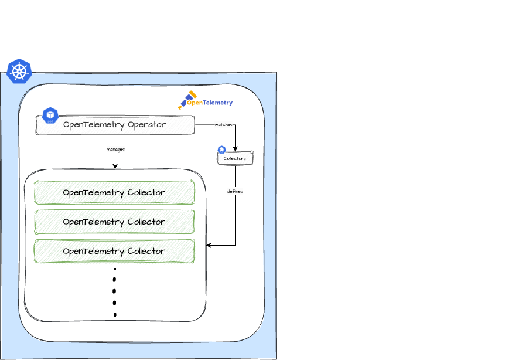

Learn more about the **OpenTelemetry Operator** Plugin. Use it to install necessary Custom Resource Definitions (CRDs) used for OpenTelemetry and an OpenTelemetry Operator that will manage the OpenTelemetryCollectors.

The main terminologies used in this document can be found in [core-concepts](https://cloudoperators.github.io/greenhouse/docs/getting-started/core-concepts).

## Overview

OpenTelemetry is an observability framework and toolkit for creating and managing telemetry data such as metrics, logs and traces. Unlike other observability tools, OpenTelemetry is vendor and tool agnostic, meaning it can be used with a variety of observability backends, including open source tools such as _OpenSearch_ and _Prometheus_.

The focus of this Plugin is to provide the foundation for other Plugins or resources that would be managed by an OpenTelemetry Operator.

Components included in this Plugin:

- [Operator](https://opentelemetry.io/docs/kubernetes/operator/)
- [CRDs for the Collector](https://github.com/open-telemetry/opentelemetry-collector)

## Architecture

## Note

It is the intention to add more configuration over time and contributions of your very own configuration is highly appreciated. If you discover bugs or want to add functionality to the Plugin, feel free to create a pull request.

## Quick Start

This guide provides a quick and straightforward way to use the **OpenTelemetry Operator** for Logs as a Greenhouse Plugin on your Kubernetes cluster.

**Prerequisites**

- A running and Greenhouse-onboarded Kubernetes cluster. If you don't have one, follow the [Cluster onboarding](https://cloudoperators.github.io/greenhouse/docs/user-guides/cluster/onboarding) guide.
- We recommend a running cert-manager in the cluster before installing the **OpenTelemetry Operator** Plugin
- To gather metrics, you **must** have a Prometheus instance in the onboarded cluster for storage and for managing Prometheus specific CRDs. If you don not have an instance, install the [kube-monitoring](https://cloudoperators.github.io/greenhouse/docs/reference/catalog/kube-monitoring) Plugin first.

**Step 1:**

You can install the **OpenTelemetry Operator** Plugin in your cluster by installing it with [Helm](https://helm.sh/docs/helm/helm_install) manually or let the Greenhouse platform lifecycle do it for you automatically. For the latter, you can either:
  1. Go to Greenhouse dashboard and select the **OpenTelemetry Operator** Plugin from the catalog. Specify the cluster and required option values.
  2. Create and specify a `Plugin` resource in your Greenhouse central cluster according to the [examples](#examples).

**Step 2:**

The package will deploy the OpenTelemetry Operator which works as a manager for the collectors and auto-instrumentation of the workload.

**Step 3:**

Greenhouse regularly performs integration tests that are bundled with the **OpenTelemetry Operator** Plugin. These provide feedback on whether all the necessary resources are installed and continuously up and running. You will find messages about this in the Plugin status and also in the Greenhouse dashboard.

**Future Steps**

The installation of the **OpenTelemetry Operator** Plugin is now **Done**. To continue you can also install any of the following Plugins, to start with the logs ingestion:

- This component is installed in the [Logs](https://github.com/cloudoperators/greenhouse-extensions/tree/main/logs) Plugin.
- This component is installed in the [Audit Logs](https://github.com/cloudoperators/greenhouse-extensions/tree/main/audit-logs) Plugin.

## Values

| Key | Type | Default | Description |
|-----|------|---------|-------------|
| opentelemetry-operator.additionalLabels | object | `{}` | additional labels to apply to all resources. |
| opentelemetry-operator.admissionWebhooks.autoGenerateCert | object | `{"recreate":false}` | Activate to use Helm to create self-signed certificates. |
| opentelemetry-operator.admissionWebhooks.autoGenerateCert.recreate | bool | `false` | Activate to recreate the cert after a defined period (certPeriodDays default is 365). |
| opentelemetry-operator.admissionWebhooks.certManager | object | `{"enabled":false}` | Activate to use the CertManager for generating self-signed certificates. |
| opentelemetry-operator.admissionWebhooks.failurePolicy | string | `"Ignore"` | Defines if the admission webhooks should `Ignore` errors or `Fail` on errors when communicating with the API server. |
| opentelemetry-operator.crds.create | bool | `false` | The required CRDs used by this dependency are version-controlled in this repository under ./crds. If you want to use the upstream CRDs, set this variable to `true``. |
| opentelemetry-operator.kubeRBACProxy | object | `{"enabled":false}` | the kubeRBACProxy can be enabled to allow the operator perform RBAC authorization against the Kubernetes API. |
| opentelemetry-operator.manager.collectorImage.repository | string | `"ghcr.io/cloudoperators/opentelemetry-collector-contrib"` | overrides the default image repository for the OpenTelemetry Collector image. |
| opentelemetry-operator.manager.collectorImage.tag | string | `"main"` | overrides the default image tag for the OpenTelemetry Collector image. |
| opentelemetry-operator.manager.image.repository | string | `"ghcr.io/open-telemetry/opentelemetry-operator/opentelemetry-operator"` | overrides the default image repository for the OpenTelemetry Operator image. |
| opentelemetry-operator.manager.image.tag | string | `"v0.120.0"` | overrides the default tag repository for the OpenTelemetry Operator image. |
| opentelemetry-operator.manager.serviceMonitor | object | `{"enabled":true}` | Enable serviceMonitor for Prometheus metrics scrape |
| opentelemetry-operator.nameOverride | string | `"operator"` | Provide a name in place of the default name `opentelemetry-operator`. |

### Examples

TBD
