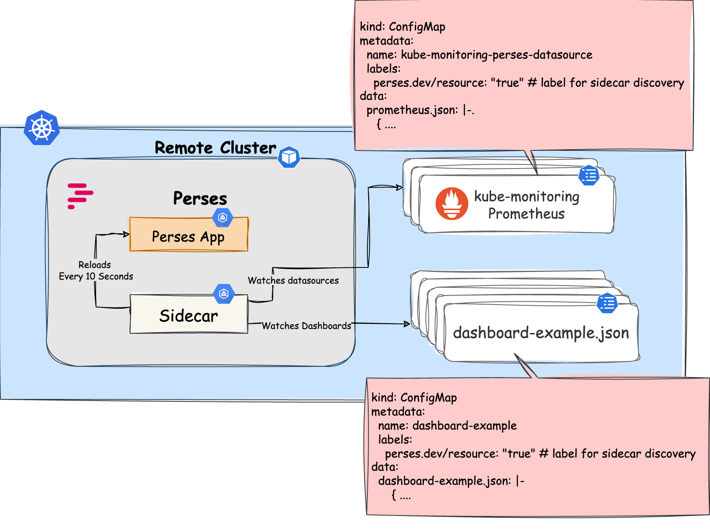

> [!WARNING]
> This plugin is in beta and please report any bugs by creating an issue [here](https://github.com/cloudoperators/greenhouse-extensions/issues/new/choose).

## Table of Contents
- [Table of Contents](#table-of-contents)
- [Overview](#overview)
- [Disclaimer](#disclaimer)
- [Quick Start](#quick-start)
- [Configuration](#configuration)
- [Create a custom dashboard](#create-a-custom-dashboard)
- [Add Dashboards as ConfigMaps](#add-dashboards-as-configmaps)
    - [Recommended folder structure](#recommended-folder-structure)


Learn more about the **Perses** Plugin. Use it to visualize Prometheus/Thanos metrics for your Greenhouse remote cluster.


The main terminologies used in this document can be found in [core-concepts](https://cloudoperators.github.io/greenhouse/docs/getting-started/core-concepts).

## Overview 

Observability is often required for the operation and automation of service offerings. [Perses](https://perses.dev/) is a CNCF project and it aims to become an open-standard for dashboards and visualization. It provides you with tools to display Prometheus metrics on live dashboards with insightful charts and visualizations. In the Greenhouse context, this complements the **kube-monitoring** plugin, which automatically acts as a Perses data source which is recognized by Perses. In addition, the Plugin provides a mechanism that automates the lifecycle of datasources and dashboards without having to restart Perses.



## Disclaimer

This is not meant to be a comprehensive package that covers all scenarios. If you are an expert, feel free to configure the Plugin according to your needs.

Contribution is highly appreciated. If you discover bugs or want to add functionality to the plugin, then pull requests are always welcome.

## Quick Start

This guide provides a quick and straightforward way how to use Perses as a Greenhouse Plugin on your Kubernetes cluster.

**Prerequisites**

- A running and Greenhouse-managed Kubernetes remote cluster
- `kube-monitoring` Plugin should be installed with `.spec.kubeMonitoring.prometheus.persesDatasource: true` and it should have at least one Prometheus instance running in the cluster

The plugin works by default with anonymous access enabled. This plugin comes with some default dashboards and the kube-monitoring datasource will be automatically discovered by the plugin.

**Step 1: Add your dashboards and datasources**

Dashboards are selected from `ConfigMaps` across namespaces. The plugin searches for `ConfigMaps` with the label `perses.dev/resource: "true"` and imports them into Perses. The `ConfigMap` must contain a key like `my-dashboard.json` with the dashboard JSON content. Please [refer this section](#add-dashboards-as-configmaps) for more information.

A guide on how to create custom dashboards on the UI can be found [here](#create-a-custom-dashboard).

## Configuration

| Parameter                                    | Description                                                                                                                      | Default                               |
| -------------------------------------------- | -------------------------------------------------------------------------------------------------------------------------------- | ------------------------------------- |
| `perses.additionalLabels`                    | Additional labels to add to all resources                                                                                        | `{}`                                  |
| `perses.annotations`                         | Statefulset annotations                                                                                                          | `{}`                                  |
| `perses.config.annotations`                  | Annotations for config                                                                                                           | `{}`                                  |
| `perses.config.database.file.extension`      | Database file extension                                                                                                          | `json`                                |
| `perses.config.database.file.folder`         | Database file folder path                                                                                                        | `/perses`                             |
| `perses.config.database.sql`                 | SQL database configuration                                                                                                       | `{}`                                  |
| `perses.config.important_dashboards`         | List of important dashboards                                                                                                     | `[]`                                  |
| `perses.config.provisioning.folders.0`       | Provisioning folder path                                                                                                         | `/etc/perses/provisioning`            |
| `perses.config.provisioning.interval`        | Provisioning check interval                                                                                                      | `10s`                                 |
| `perses.config.schemas.datasources_path`     | Datasource schemas path                                                                                                          | `/etc/perses/cue/schemas/datasources` |
| `perses.config.schemas.interval`             | Schema check interval                                                                                                            | `5m`                                  |
| `perses.config.schemas.panels_path`          | Panel schemas path                                                                                                               | `/etc/perses/cue/schemas/panels`      |
| `perses.config.schemas.queries_path`         | Query schemas path                                                                                                               | `/etc/perses/cue/schemas/queries`     |
| `perses.config.schemas.variables_path`       | Variable schemas path                                                                                                            | `/etc/perses/cue/schemas/variables`   |
| `perses.config.security.cookie.same_site`    | Cookie SameSite attribute                                                                                                        | `lax`                                 |
| `perses.config.security.cookie.secure`       | Enable secure cookies                                                                                                            | `false`                               |
| `perses.config.security.enableAuth`          | Enable authentication                                                                                                            | `false`                               |
| `perses.config.security.readOnly`            | Configure Perses instance as readonly mode                                                                                       | `false`                               |
| `perses.datasources`                         | Configure datasources (DEPRECATED). Please use the 'sidecar' configuration to provision datasources                              | `[]`                                  |
| `perses.fullnameOverride`                    | Override fully qualified app name                                                                                                | `""`                                  |
| `perses.image.name`                          | Container image name                                                                                                             | `persesdev/perses`                    |
| `perses.image.pullPolicy`                    | Image pull policy                                                                                                                | `IfNotPresent`                        |
| `perses.image.version`                       | Override default image tag                                                                                                       | `""`                                  |
| `perses.ingress.annotations`                 | Additional annotations for the Ingress resource. To enable certificate autogeneration, place here your cert-manager annotations. | `{}`                                  |
| `perses.ingress.enabled`                     | Configure the ingress resource that allows you to access Thanos Query Frontend                                                   | `false`                               |
| `perses.ingress.hosts`                       | Ingress hostnames                                                                                                                | `["perses.local"]`                    |
| `perses.ingress.ingressClassName`            | IngressClass that will be be used to implement the Ingress (Kubernetes 1.18+)                                                    | `""`                                  |
| `perses.ingress.path`                        | Ingress path                                                                                                                     | `/`                                   |
| `perses.ingress.pathType`                    | Ingress path type                                                                                                                | `Prefix`                              |
| `perses.ingress.tls`                         | Ingress TLS configuration                                                                                                        | `[]`                                  |
| `perses.livenessProbe.enabled`               | Enable liveness probe                                                                                                            | `true`                                |
| `perses.livenessProbe.failureThreshold`      | Liveness probe failure threshold                                                                                                 | `5`                                   |
| `perses.livenessProbe.initialDelaySeconds`   | Liveness probe initial delay                                                                                                     | `10`                                  |
| `perses.livenessProbe.periodSeconds`         | Liveness probe period                                                                                                            | `60`                                  |
| `perses.livenessProbe.successThreshold`      | Liveness probe success threshold                                                                                                 | `1`                                   |
| `perses.livenessProbe.timeoutSeconds`        | Liveness probe timeout                                                                                                           | `5`                                   |
| `perses.logLevel`                            | Logging level - available options "panic", "error", "warning", "info", "debug", "trace" level                                    | `info`                                |
| `perses.nameOverride`                        | Override chart name                                                                                                              | `""`                                  |
| `perses.persistence.accessModes`             | PVC access modes for data volume                                                                                                 | `["ReadWriteOnce"]`                   |
| `perses.persistence.annotations`             | PVC annotations                                                                                                                  | `{}`                                  |
| `perses.persistence.enabled`                 | Enable persistence. If disabled, it will use a emptydir volume                                                                   | `false`                               |
| `perses.persistence.labels`                  | PVC labels                                                                                                                       | `{}`                                  |
| `perses.persistence.securityContext.fsGroup` | Security context for the PVC when persistence is enabled                                                                         | `2000`                                |
| `perses.persistence.size`                    | PVC storage size                                                                                                                 | `8Gi`                                 |
| `perses.readinessProbe.enabled`              | Enable readiness probe                                                                                                           | `true`                                |
| `perses.readinessProbe.failureThreshold`     | Readiness probe failure threshold                                                                                                | `5`                                   |
| `perses.readinessProbe.initialDelaySeconds`  | Readiness probe initial delay                                                                                                    | `5`                                   |
| `perses.readinessProbe.periodSeconds`        | Readiness probe period                                                                                                           | `10`                                  |
| `perses.readinessProbe.successThreshold`     | Readiness probe success threshold                                                                                                | `1`                                   |
| `perses.readinessProbe.timeoutSeconds`       | Readiness probe timeout                                                                                                          | `5`                                   |
| `perses.replicas`                            | Number of replicas                                                                                                               | `1`                                   |
| `perses.resources`                           | Resource limits and requests                                                                                                     | `{}`                                  |
| `perses.service.annotations`                 | Service annotations                                                                                                              | `{}`                                  |
| `perses.service.labels`                      | Service labels                                                                                                                   | `{}`                                  |
| `perses.service.port`                        | Service port                                                                                                                     | `8080`                                |
| `perses.service.portName`                    | Service port name                                                                                                                | `http`                                |
| `perses.service.targetPort`                  | Container target port                                                                                                            | `8080`                                |
| `perses.service.type`                        | Service type                                                                                                                     | `ClusterIP`                           |
| `perses.serviceAccount.annotations`          | Service account annotations                                                                                                      | `{}`                                  |
| `perses.serviceAccount.create`               | Create service account                                                                                                           | `true`                                |
| `perses.serviceAccount.name`                 | Service account name                                                                                                             | `""`                                  |
| `perses.sidecar.enabled`                     | Enable sidecar to auto discover the configmaps holding perses dashboards and datasources                                         | `false`                               |
| `perses.sidecar.image.repository`            | Container image repository for the sidecar                                                                                       | `kiwigrid/k8s-sidecar`                |
| `perses.sidecar.image.tag`                   | Container image tag for the sidecar                                                                                              | `1.28.0`                              |
| `perses.sidecar.label`                       | Label key to watch for ConfigMaps containing Perses resources                                                                    | `perses.dev/resource`                 |
| `perses.sidecar.labelValue`                  | Label value to watch for ConfigMaps containing Perses resources                                                                  | `"true"`                              |
| `perses.volumeMounts`                        | Additional volume mounts                                                                                                         | `[]`                                  |
| `perses.volumes`                             | Additional volumes                                                                                                               | `[]`                                  |


## Create a custom dashboard

1. Add a new Project by clicking on **ADD PROJECT** in the top right corner. Give it a name and click **Add**.
2. Add a new dashboard by clicking on **ADD DASHBOARD**. Give it a name and click **Add**.
3. Now you can add variables, panels to your dashboard.
4. You can group your panels by adding the panels to a Panel Group.
5. Move and resize the panels as needed.
6. Watch [this gif](https://perses.dev/) to learn more.
7. You do not need to add the kube-monitoring datasource manually. It will be automatically discovered by Perses.
8. Click **Save** after you have made changes.
9. Export the dashboard.
   - Click on the **{}** icon in the top right corner of the dashboard.
   - Copy the entire JSON model.
   - See the next section for detailed instructions on how and where to paste the copied dashboard JSON model.


## Add Dashboards as ConfigMaps

By default, a sidecar container is deployed in the Perses pod. This container watches all configmaps in the cluster and filters out the ones with a label `perses.dev/resource: "true"`. The files defined in those configmaps are written to a folder and this folder is accessed by Perses. Changes to the configmaps are continuously monitored and are reflected in Perses within 10 seconds.

A recommendation is to use one configmap per dashboard. This way, you can easily manage the dashboards in your git repository.

#### Recommended folder structure

*Folder structure:*
```bash
dashboards/
├── dashboard1.json
├── dashboard2.json
├── prometheusdatasource1.json
├── prometheusdatasource2.json
templates/
├──dashboard-json-configmap.yaml
```

*Helm template to create a configmap for each dashboard:*
```yaml
{{- range $path, $bytes := .Files.Glob "dashboards/*.json" }}
---
apiVersion: v1
kind: ConfigMap

metadata:
  name: {{ printf "%s-%s" $.Release.Name $path | replace "/" "-" | trunc 63 }}
  labels:
    perses.dev/resource: "true"

data:
{{ printf "%s: |-" $path | replace "/" "-" | indent 2 }}
{{ printf "%s" $bytes | indent 4 }}

{{- end }}
```
