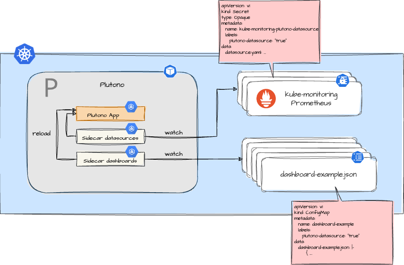

Learn more about the **plutono** Plugin. Use it to install the web dashboarding system [Plutono](https://github.com/credativ/plutono) to collect, correlate, and visualize Prometheus metrics for your Greenhouse cluster.

The main terminologies used in this document can be found in [core-concepts](https://cloudoperators.github.io/greenhouse/docs/getting-started/core-concepts).

## Overview

Observability is often required for the operation and automation of service offerings. Plutono provides you with tools to display Prometheus metrics on live dashboards with insightful charts and visualizations. In the Greenhouse context, this complements the **kube-monitoring** plugin, which automatically acts as a Plutono data source which is recognized by Plutono. In addition, the Plugin provides a mechanism that automates the lifecycle of datasources and dashboards without having to restart Plutono.



## Disclaimer

This is not meant to be a comprehensive package that covers all scenarios. If you are an expert, feel free to configure the Plugin according to your needs.

Contribution is highly appreciated. If you discover bugs or want to add functionality to the plugin, then pull requests are always welcome.

## Quick Start

This guide provides a quick and straightforward way how to use Plutono as a Greenhouse Plugin on your Kubernetes cluster.

**Prerequisites**

- A running and Greenhouse-managed Kubernetes cluster
- `kube-monitoring` Plugin installed to have at least one Prometheus instance running in the cluster

The plugin works by default with anonymous access enabled. If you use the standard configuration in the **kube-monitoring** plugin, the data source and some [kubernetes-operations](https://github.com/cloudoperators/kubernetes-operations) dashboards are already pre-installed.

**Step 1: Add your dashboards**

Dashboards are selected from `ConfigMaps` across namespaces. The plugin searches for `ConfigMaps` with the label `plutono-dashboard: "true"` and imports them into Plutono. The `ConfigMap` must contain a key like `my-dashboard.json` with the dashboard JSON content. [Example](https://github.com/cloudoperators/greenhouse-extensions/blob/main/plutono/README.md#example-dashboard-config)

A guide on how to create dashboards can be found [here](https://github.com/cloudoperators/greenhouse-extensions/blob/main/plutono/README.md#create-a-dashboard).

**Step 2: Add your datasources**

Data sources are selected from `Secrets` across namespaces. The plugin searches for `Secrets` with the label `plutono-dashboard: "true"` and imports them into Plutono. The `Secrets` should contain valid datasource configuration YAML. [Example](https://github.com/cloudoperators/greenhouse-extensions/blob/main/plutono/README.md#example-datasource-config)

## Values

| Key | Type | Default | Description |
|-----|------|---------|-------------|
| global.imagePullSecrets | list | `[]` | To help compatibility with other charts which use global.imagePullSecrets. Allow either an array of {name: pullSecret} maps (k8s-style), or an array of strings (more common helm-style). Can be templated. global:   imagePullSecrets:   - name: pullSecret1   - name: pullSecret2 or global:   imagePullSecrets:   - pullSecret1   - pullSecret2 |
| global.imageRegistry | string | `nil` | Overrides the Docker registry globally for all images |
| plutono."plutono.ini"."auth.anonymous".enabled | bool | `true` |  |
| plutono."plutono.ini"."auth.anonymous".org_role | string | `"Admin"` |  |
| plutono."plutono.ini".auth.disable_login_form | bool | `true` |  |
| plutono."plutono.ini".log.mode | string | `"console"` |  |
| plutono."plutono.ini".paths.data | string | `"/var/lib/plutono/"` |  |
| plutono."plutono.ini".paths.logs | string | `"/var/log/plutono"` |  |
| plutono."plutono.ini".paths.plugins | string | `"/var/lib/plutono/plugins"` |  |
| plutono."plutono.ini".paths.provisioning | string | `"/etc/plutono/provisioning"` |  |
| plutono.admin.existingSecret | string | `""` |  |
| plutono.admin.passwordKey | string | `"admin-password"` |  |
| plutono.admin.userKey | string | `"admin-user"` |  |
| plutono.adminPassword | string | `"strongpassword"` |  |
| plutono.adminUser | string | `"admin"` |  |
| plutono.affinity | object | `{}` | Affinity for pod assignment (evaluated as template) ref: https://kubernetes.io/docs/concepts/configuration/assign-pod-node/#affinity-and-anti-affinity  |
| plutono.alerting | object | `{}` |  |
| plutono.assertNoLeakedSecrets | bool | `true` |  |
| plutono.automountServiceAccountToken | bool | `true` | Should the service account be auto mounted on the pod |
| plutono.autoscaling | object | `{"behavior":{},"enabled":false,"maxReplicas":5,"minReplicas":1,"targetCPU":"60","targetMemory":""}` | Create HorizontalPodAutoscaler object for deployment type  |
| plutono.containerSecurityContext.allowPrivilegeEscalation | bool | `false` |  |
| plutono.containerSecurityContext.capabilities.drop[0] | string | `"ALL"` |  |
| plutono.containerSecurityContext.seccompProfile.type | string | `"RuntimeDefault"` |  |
| plutono.createConfigmap | bool | `true` | Enable creating the plutono configmap |
| plutono.dashboardProviders | object | `{}` |  |
| plutono.dashboards | object | `{}` |  |
| plutono.dashboardsConfigMaps | object | `{}` |  |
| plutono.datasources | object | `{}` |  |
| plutono.deploymentStrategy | object | `{"type":"RollingUpdate"}` | See `kubectl explain deployment.spec.strategy` for more # ref: https://kubernetes.io/docs/concepts/workloads/controllers/deployment/#strategy |
| plutono.dnsConfig | object | `{}` |  |
| plutono.dnsPolicy | string | `nil` | dns configuration for pod |
| plutono.downloadDashboards.env | object | `{}` |  |
| plutono.downloadDashboards.envFromSecret | string | `""` |  |
| plutono.downloadDashboards.envValueFrom | object | `{}` |  |
| plutono.downloadDashboards.resources | object | `{}` |  |
| plutono.downloadDashboards.securityContext.allowPrivilegeEscalation | bool | `false` |  |
| plutono.downloadDashboards.securityContext.capabilities.drop[0] | string | `"ALL"` |  |
| plutono.downloadDashboards.securityContext.seccompProfile.type | string | `"RuntimeDefault"` |  |
| plutono.downloadDashboardsImage.pullPolicy | string | `"IfNotPresent"` |  |
| plutono.downloadDashboardsImage.registry | string | `"docker.io"` | The Docker registry |
| plutono.downloadDashboardsImage.repository | string | `"curlimages/curl"` |  |
| plutono.downloadDashboardsImage.sha | string | `""` |  |
| plutono.downloadDashboardsImage.tag | string | `"8.14.1"` |  |
| plutono.enableKubeBackwardCompatibility | bool | `false` | Enable backward compatibility of kubernetes where version below 1.13 doesn't have the enableServiceLinks option |
| plutono.enableServiceLinks | bool | `true` |  |
| plutono.env | object | `{}` |  |
| plutono.envFromConfigMaps | list | `[]` | The names of conifgmaps in the same kubernetes namespace which contain values to be added to the environment Each entry should contain a name key, and can optionally specify whether the configmap must be defined with an optional key. Name is templated. ref: https://kubernetes.io/docs/reference/generated/kubernetes-api/v1.23/#configmapenvsource-v1-core |
| plutono.envFromSecret | string | `""` | The name of a secret in the same kubernetes namespace which contain values to be added to the environment This can be useful for auth tokens, etc. Value is templated. |
| plutono.envFromSecrets | list | `[]` | The names of secrets in the same kubernetes namespace which contain values to be added to the environment Each entry should contain a name key, and can optionally specify whether the secret must be defined with an optional key. Name is templated. |
| plutono.envRenderSecret | object | `{}` | Sensible environment variables that will be rendered as new secret object This can be useful for auth tokens, etc. If the secret values contains "{{", they'll need to be properly escaped so that they are not interpreted by Helm ref: https://helm.sh/docs/howto/charts_tips_and_tricks/#using-the-tpl-function |
| plutono.envValueFrom | object | `{}` |  |
| plutono.extraConfigmapMounts | list | `[]` | Values are templated. |
| plutono.extraContainerVolumes | list | `[]` | Volumes that can be used in init containers that will not be mounted to deployment pods |
| plutono.extraContainers | string | `""` | Enable an Specify container in extraContainers. This is meant to allow adding an authentication proxy to a plutono pod |
| plutono.extraEmptyDirMounts | list | `[]` |  |
| plutono.extraExposePorts | list | `[]` |  |
| plutono.extraInitContainers | list | `[]` | Additional init containers (evaluated as template) ref: https://kubernetes.io/docs/concepts/workloads/pods/init-containers/  |
| plutono.extraLabels | object | `{"plugin":"plutono"}` | Apply extra labels to common labels. |
| plutono.extraObjects | list | `[]` | Create a dynamic manifests via values: |
| plutono.extraSecretMounts | list | `[]` | The additional plutono server secret mounts Defines additional mounts with secrets. Secrets must be manually created in the namespace. |
| plutono.extraVolumeMounts | list | `[]` | The additional plutono server volume mounts Defines additional volume mounts. |
| plutono.extraVolumes | list | `[]` |  |
| plutono.gossipPortName | string | `"gossip"` |  |
| plutono.headlessService | bool | `false` | Create a headless service for the deployment |
| plutono.hostAliases | list | `[]` | overrides pod.spec.hostAliases in the plutono deployment's pods |
| plutono.image.pullPolicy | string | `"IfNotPresent"` |  |
| plutono.image.pullSecrets | list | `[]` | Optionally specify an array of imagePullSecrets. # Secrets must be manually created in the namespace. # ref: https://kubernetes.io/docs/tasks/configure-pod-container/pull-image-private-registry/ # Can be templated. # |
| plutono.image.registry | string | `"ghcr.io"` |  |
| plutono.image.repository | string | `"credativ/plutono"` |  |
| plutono.image.sha | string | `""` |  |
| plutono.image.tag | string | `"v7.5.45"` | Overrides the Plutono image tag whose default is the chart appVersion |
| plutono.ingress.annotations | object | `{}` |  |
| plutono.ingress.enabled | bool | `false` |  |
| plutono.ingress.extraPaths | list | `[]` | Extra paths to prepend to every host configuration. This is useful when working with annotation based services. |
| plutono.ingress.hosts[0] | string | `"chart-example.local"` |  |
| plutono.ingress.labels | object | `{}` |  |
| plutono.ingress.path | string | `"/"` |  |
| plutono.ingress.pathType | string | `"Prefix"` | pathType is only for k8s >= 1.1= |
| plutono.ingress.tls | list | `[]` |  |
| plutono.lifecycleHooks | object | `{}` |  |
| plutono.livenessProbe.failureThreshold | int | `10` |  |
| plutono.livenessProbe.httpGet.path | string | `"/api/health"` |  |
| plutono.livenessProbe.httpGet.port | int | `3000` |  |
| plutono.livenessProbe.initialDelaySeconds | int | `60` |  |
| plutono.livenessProbe.timeoutSeconds | int | `30` |  |
| plutono.namespaceOverride | string | `""` |  |
| plutono.networkPolicy.allowExternal | bool | `true` | @param networkPolicy.ingress When true enables the creation # an ingress network policy # |
| plutono.networkPolicy.egress.blockDNSResolution | bool | `false` | @param networkPolicy.egress.blockDNSResolution When enabled, DNS resolution will be blocked # for all pods in the plutono namespace. |
| plutono.networkPolicy.egress.enabled | bool | `false` | @param networkPolicy.egress.enabled When enabled, an egress network policy will be # created allowing plutono to connect to external data sources from kubernetes cluster. |
| plutono.networkPolicy.egress.ports | list | `[]` | @param networkPolicy.egress.ports Add individual ports to be allowed by the egress |
| plutono.networkPolicy.egress.to | list | `[]` |  |
| plutono.networkPolicy.enabled | bool | `false` | @param networkPolicy.enabled Enable creation of NetworkPolicy resources. Only Ingress traffic is filtered for now. # |
| plutono.networkPolicy.explicitNamespacesSelector | object | `{}` | @param networkPolicy.explicitNamespacesSelector A Kubernetes LabelSelector to explicitly select namespaces from which traffic could be allowed # If explicitNamespacesSelector is missing or set to {}, only client Pods that are in the networkPolicy's namespace # and that match other criteria, the ones that have the good label, can reach the plutono. # But sometimes, we want the plutono to be accessible to clients from other namespaces, in this case, we can use this # LabelSelector to select these namespaces, note that the networkPolicy's namespace should also be explicitly added. # # Example: # explicitNamespacesSelector: #   matchLabels: #     role: frontend #   matchExpressions: #    - {key: role, operator: In, values: [frontend]} # |
| plutono.networkPolicy.ingress | bool | `true` | @param networkPolicy.allowExternal Don't require client label for connections # The Policy model to apply. When set to false, only pods with the correct # client label will have network access to  plutono port defined. # When true, plutono will accept connections from any source # (with the correct destination port). # |
| plutono.nodeSelector | object | `{}` | Node labels for pod assignment ref: https://kubernetes.io/docs/user-guide/node-selection/  |
| plutono.persistence | object | `{"accessModes":["ReadWriteOnce"],"disableWarning":false,"enabled":false,"extraPvcLabels":{},"finalizers":["kubernetes.io/pvc-protection"],"inMemory":{"enabled":false},"lookupVolumeName":true,"size":"10Gi","type":"pvc"}` | Enable persistence using Persistent Volume Claims ref: http://kubernetes.io/docs/user-guide/persistent-volumes/  |
| plutono.persistence.extraPvcLabels | object | `{}` | Extra labels to apply to a PVC. |
| plutono.persistence.inMemory | object | `{"enabled":false}` | If persistence is not enabled, this allows to mount the # local storage in-memory to improve performance # |
| plutono.persistence.lookupVolumeName | bool | `true` | If 'lookupVolumeName' is set to true, Helm will attempt to retrieve the current value of 'spec.volumeName' and incorporate it into the template. |
| plutono.plugins | list | `[]` |  |
| plutono.podDisruptionBudget | object | `{}` | See `kubectl explain poddisruptionbudget.spec` for more # ref: https://kubernetes.io/docs/tasks/run-application/configure-pdb/ |
| plutono.podPortName | string | `"plutono"` |  |
| plutono.rbac.create | bool | `true` |  |
| plutono.rbac.extraClusterRoleRules | list | `[]` |  |
| plutono.rbac.extraRoleRules | list | `[]` |  |
| plutono.rbac.namespaced | bool | `false` |  |
| plutono.rbac.pspEnabled | bool | `false` | Use an existing ClusterRole/Role (depending on rbac.namespaced false/true) useExistingRole: name-of-some-role useExistingClusterRole: name-of-some-clusterRole |
| plutono.rbac.pspUseAppArmor | bool | `false` |  |
| plutono.readinessProbe.httpGet.path | string | `"/api/health"` |  |
| plutono.readinessProbe.httpGet.port | int | `3000` |  |
| plutono.replicas | int | `1` |  |
| plutono.resources | object | `{}` |  |
| plutono.revisionHistoryLimit | int | `10` |  |
| plutono.securityContext.fsGroup | int | `472` |  |
| plutono.securityContext.runAsGroup | int | `472` |  |
| plutono.securityContext.runAsNonRoot | bool | `true` |  |
| plutono.securityContext.runAsUser | int | `472` |  |
| plutono.service | object | `{"annotations":{"greenhouse.sap/expose":"true"},"appProtocol":"","enabled":true,"ipFamilies":[],"ipFamilyPolicy":"","labels":{"greenhouse.sap/expose":"true"},"loadBalancerClass":"","loadBalancerIP":"","loadBalancerSourceRanges":[],"port":80,"portName":"service","targetPort":3000,"type":"ClusterIP"}` | Expose the plutono service to be accessed from outside the cluster (LoadBalancer service). # or access it from within the cluster (ClusterIP service). Set the service type and the port to serve it. # ref: http://kubernetes.io/docs/user-guide/services/ # |
| plutono.service.annotations | object | `{"greenhouse.sap/expose":"true"}` | Service annotations. Can be templated. |
| plutono.service.appProtocol | string | `""` | Adds the appProtocol field to the service. This allows to work with istio protocol selection. Ex: "http" or "tcp" |
| plutono.service.ipFamilies | list | `[]` | Sets the families that should be supported and the order in which they should be applied to ClusterIP as well. Can be IPv4 and/or IPv6. |
| plutono.service.ipFamilyPolicy | string | `""` | Set the ip family policy to configure dual-stack see [Configure dual-stack](https://kubernetes.io/docs/concepts/services-networking/dual-stack/#services) |
| plutono.serviceAccount.automountServiceAccountToken | bool | `false` |  |
| plutono.serviceAccount.create | bool | `true` |  |
| plutono.serviceAccount.labels | object | `{}` |  |
| plutono.serviceAccount.name | string | `nil` |  |
| plutono.serviceAccount.nameTest | string | `nil` |  |
| plutono.serviceMonitor.enabled | bool | `false` | If true, a ServiceMonitor CR is created for a prometheus operator # https://github.com/coreos/prometheus-operator # |
| plutono.serviceMonitor.interval | string | `"30s"` |  |
| plutono.serviceMonitor.labels | object | `{}` | namespace: monitoring  (defaults to use the namespace this chart is deployed to) |
| plutono.serviceMonitor.metricRelabelings | list | `[]` |  |
| plutono.serviceMonitor.path | string | `"/metrics"` |  |
| plutono.serviceMonitor.relabelings | list | `[]` |  |
| plutono.serviceMonitor.scheme | string | `"http"` |  |
| plutono.serviceMonitor.scrapeTimeout | string | `"30s"` |  |
| plutono.serviceMonitor.targetLabels | list | `[]` |  |
| plutono.serviceMonitor.tlsConfig | object | `{}` |  |
| plutono.sidecar | object | {} | Sidecars that collect the configmaps with specified label and stores the included files them into the respective folders Requires at least Plutono 5 to work and can't be used together with parameters dashboardProviders, datasources and dashboards |
| plutono.sidecar.alerts.env | object | `{}` | Additional environment variables for the alerts sidecar |
| plutono.sidecar.alerts.label | string | `"plutono_alert"` | label that the configmaps with alert are marked with |
| plutono.sidecar.alerts.labelValue | string | `""` | value of label that the configmaps with alert are set to |
| plutono.sidecar.alerts.resource | string | `"both"` | search in configmap, secret or both |
| plutono.sidecar.alerts.searchNamespace | string | `nil` | If specified, the sidecar will search for alert config-maps inside this namespace. Otherwise the namespace in which the sidecar is running will be used. It's also possible to specify ALL to search in all namespaces |
| plutono.sidecar.alerts.watchMethod | string | `"WATCH"` | Method to use to detect ConfigMap changes. With WATCH the sidecar will do a WATCH requests, with SLEEP it will list all ConfigMaps, then sleep for 60 seconds. |
| plutono.sidecar.dashboards.defaultFolderName | string | `nil` | The default folder name, it will create a subfolder under the `folder` and put dashboards in there instead |
| plutono.sidecar.dashboards.extraMounts | list | `[]` | Additional dashboard sidecar volume mounts |
| plutono.sidecar.dashboards.folder | string | `"/tmp/dashboards"` | folder in the pod that should hold the collected dashboards (unless `defaultFolderName` is set) |
| plutono.sidecar.dashboards.folderAnnotation | string | `nil` | If specified, the sidecar will look for annotation with this name to create folder and put graph here. You can use this parameter together with `provider.foldersFromFilesStructure`to annotate configmaps and create folder structure. |
| plutono.sidecar.dashboards.provider | object | `{"allowUiUpdates":false,"disableDelete":false,"folder":"","folderUid":"","foldersFromFilesStructure":false,"name":"sidecarProvider","orgid":1,"type":"file"}` | watchServerTimeout: request to the server, asking it to cleanly close the connection after that. defaults to 60sec; much higher values like 3600 seconds (1h) are feasible for non-Azure K8S watchServerTimeout: 3600  watchClientTimeout: is a client-side timeout, configuring your local socket. If you have a network outage dropping all packets with no RST/FIN, this is how long your client waits before realizing & dropping the connection. defaults to 66sec (sic!) watchClientTimeout: 60  provider configuration that lets plutono manage the dashboards |
| plutono.sidecar.dashboards.provider.allowUiUpdates | bool | `false` | allow updating provisioned dashboards from the UI |
| plutono.sidecar.dashboards.provider.disableDelete | bool | `false` | disableDelete to activate a import-only behaviour |
| plutono.sidecar.dashboards.provider.folder | string | `""` | folder in which the dashboards should be imported in plutono |
| plutono.sidecar.dashboards.provider.folderUid | string | `""` | <string> folder UID. will be automatically generated if not specified |
| plutono.sidecar.dashboards.provider.foldersFromFilesStructure | bool | `false` | allow Plutono to replicate dashboard structure from filesystem |
| plutono.sidecar.dashboards.provider.name | string | `"sidecarProvider"` | name of the provider, should be unique |
| plutono.sidecar.dashboards.provider.orgid | int | `1` | orgid as configured in plutono |
| plutono.sidecar.dashboards.provider.type | string | `"file"` | type of the provider |
| plutono.sidecar.dashboards.reloadURL | string | `"http://localhost:3000/api/admin/provisioning/dashboards/reload"` | Endpoint to send request to reload alerts |
| plutono.sidecar.dashboards.searchNamespace | string | `"ALL"` | Namespaces list. If specified, the sidecar will search for config-maps/secrets inside these namespaces. Otherwise the namespace in which the sidecar is running will be used. It's also possible to specify ALL to search in all namespaces. |
| plutono.sidecar.dashboards.sizeLimit | object | `{}` | Sets the size limit of the dashboard sidecar emptyDir volume |
| plutono.sidecar.datasources.env | object | `{}` | Additional environment variables for the datasourcessidecar |
| plutono.sidecar.datasources.initDatasources | bool | `false` | This is needed if skipReload is true, to load any datasources defined at startup time. Deploy the datasources sidecar as an initContainer. |
| plutono.sidecar.datasources.reloadURL | string | `"http://localhost:3000/api/admin/provisioning/datasources/reload"` | Endpoint to send request to reload datasources |
| plutono.sidecar.datasources.resource | string | `"both"` | search in configmap, secret or both |
| plutono.sidecar.datasources.script | string | `nil` | Absolute path to shell script to execute after a datasource got reloaded |
| plutono.sidecar.datasources.searchNamespace | string | `"ALL"` | If specified, the sidecar will search for datasource config-maps inside this namespace. Otherwise the namespace in which the sidecar is running will be used. It's also possible to specify ALL to search in all namespaces |
| plutono.sidecar.datasources.watchMethod | string | `"WATCH"` | Method to use to detect ConfigMap changes. With WATCH the sidecar will do a WATCH requests, with SLEEP it will list all ConfigMaps, then sleep for 60 seconds. |
| plutono.sidecar.image.registry | string | `"quay.io"` | The Docker registry |
| plutono.testFramework.enabled | bool | `true` |  |
| plutono.testFramework.image.registry | string | `"ghcr.io"` |  |
| plutono.testFramework.image.repository | string | `"cloudoperators/greenhouse-extensions-integration-test"` |  |
| plutono.testFramework.image.tag | string | `"main"` |  |
| plutono.testFramework.imagePullPolicy | string | `"IfNotPresent"` |  |
| plutono.testFramework.resources | object | `{}` |  |
| plutono.testFramework.securityContext | object | `{}` |  |
| plutono.tolerations | list | `[]` | Tolerations for pod assignment ref: https://kubernetes.io/docs/concepts/configuration/taint-and-toleration/  |
| plutono.topologySpreadConstraints | list | `[]` | Topology Spread Constraints ref: https://kubernetes.io/docs/concepts/workloads/pods/pod-topology-spread-constraints/  |
| plutono.useStatefulSet | bool | `false` |  |

### Example of extraVolumeMounts and extraVolumes

Configure additional volumes with `extraVolumes` and volume mounts with `extraVolumeMounts`.

Example for `extraVolumeMounts` and corresponding `extraVolumes`:

```yaml
extraVolumeMounts:
  - name: plugins
    mountPath: /var/lib/plutono/plugins
    subPath: configs/plutono/plugins
    readOnly: false
  - name: dashboards
    mountPath: /var/lib/plutono/dashboards
    hostPath: /usr/shared/plutono/dashboards
    readOnly: false

extraVolumes:
  - name: plugins
    existingClaim: existing-plutono-claim
  - name: dashboards
    hostPath: /usr/shared/plutono/dashboards
```

Volumes default to `emptyDir`. Set to `persistentVolumeClaim`,
`hostPath`, `csi`, or `configMap` for other types. For a
`persistentVolumeClaim`, specify an existing claim name with
`existingClaim`.

## Import dashboards

There are a few methods to import dashboards to Plutono. Below are some examples and explanations as to how to use each method:

```yaml
dashboards:
  default:
    some-dashboard:
      json: |
        {
          "annotations":

          ...
          # Complete json file here
          ...

          "title": "Some Dashboard",
          "uid": "abcd1234",
          "version": 1
        }
    custom-dashboard:
      # This is a path to a file inside the dashboards directory inside the chart directory
      file: dashboards/custom-dashboard.json
    prometheus-stats:
      # Ref: https://plutono.com/dashboards/2
      gnetId: 2
      revision: 2
      datasource: Prometheus
    loki-dashboard-quick-search:
      gnetId: 12019
      revision: 2
      datasource:
      - name: DS_PROMETHEUS
        value: Prometheus
    local-dashboard:
      url: https://raw.githubusercontent.com/user/repository/master/dashboards/dashboard.json
```

## Create a dashboard

1. Click **Dashboards** in the main menu.
2. Click **New** and select **New Dashboard**.
3. Click **Add new empty panel**.
4. **Important:** Add a datasource variable as they are provisioned in the cluster.
   - Go to **Dashboard settings**.
   - Click **Variables**.
   - Click **Add variable**.
   - General: Configure the variable with a proper **Name** as **Type** `Datasource`.
   - Data source options: Select the data source **Type** e.g. `Prometheus`.
   - Click **Update**.
   - Go back.

5. Develop your panels.
   - On the **Edit panel** view, choose your desired **Visualization**.
   - Select the datasource variable you just created.
   - Write or construct a query in the query language of your data source.
   - Move and resize the panels as needed.
6. Optionally add a **tag** to the dashboard to make grouping easier.
   - Go to **Dashboard settings**.
   - In the **General** section, add a **Tag**.
7. Click **Save**. Note that the dashboard is saved in the browser's local storage.
8. Export the dashboard.
   - Go to **Dashboard settings**.
   - Click **JSON Model**.
   - Copy the JSON model.
   - Go to your Github repository and create a new JSON file in the `dashboards` directory.

## BASE64 dashboards

Dashboards could be stored on a server that does not return JSON directly and instead of it returns a Base64 encoded file (e.g. Gerrit)
A new parameter has been added to the url use case so if you specify a b64content value equals to true after the url entry a Base64 decoding is applied before save the file to disk.
If this entry is not set or is equals to false not decoding is applied to the file before saving it to disk.

### Gerrit use case

Gerrit API for download files has the following schema: <https://yourgerritserver/a/{project-name}/branches/{branch-id}/files/{file-id}/content> where {project-name} and
{file-id} usually has '/' in their values and so they MUST be replaced by %2F so if project-name is user/repo, branch-id is master and file-id is equals to dir1/dir2/dashboard
the url value is <https://yourgerritserver/a/user%2Frepo/branches/master/files/dir1%2Fdir2%2Fdashboard/content>

## Sidecar for dashboards

If the parameter `sidecar.dashboards.enabled` is set, a sidecar container is deployed in the plutono
pod. This container watches all configmaps (or secrets) in the cluster and filters out the ones with
a label as defined in `sidecar.dashboards.label`. The files defined in those configmaps are written
to a folder and accessed by plutono. Changes to the configmaps are monitored and the imported
dashboards are deleted/updated.

A recommendation is to use one configmap per dashboard, as a reduction of multiple dashboards inside
one configmap is currently not properly mirrored in plutono.

NOTE: Configure your data sources in your dashboards as variables to keep them portable across clusters.

#### Example dashboard config:

*Folder structure:*
```bash
dashboards/
├── dashboard1.json
├── dashboard2.json
templates/
├──dashboard-json-configmap.yaml
```

*Helm template to create a configmap for each dashboard:*
```yaml
{{- range $path, $bytes := .Files.Glob "dashboards/*.json" }}
---
apiVersion: v1
kind: ConfigMap

metadata:
  name: {{ printf "%s-%s" $.Release.Name $path | replace "/" "-" | trunc 63 }}
  labels:
    plutono-dashboard: "true"

data:
{{ printf "%s: |-" $path | replace "/" "-" | indent 2 }}
{{ printf "%s" $bytes | indent 4 }}

{{- end }}
```

## Sidecar for datasources

If the parameter `sidecar.datasources.enabled` is set, an init container is deployed in the plutono
pod. This container lists all secrets (or configmaps, though not recommended) in the cluster and
filters out the ones with a label as defined in `sidecar.datasources.label`. The files defined in
those secrets are written to a folder and accessed by plutono on startup. Using these yaml files,
the data sources in plutono can be imported.

Should you aim for reloading datasources in Plutono each time the config is changed, set `sidecar.datasources.skipReload: false` and adjust `sidecar.datasources.reloadURL` to `http://<svc-name>.<namespace>.svc.cluster.local/api/admin/provisioning/datasources/reload`.

Secrets are recommended over configmaps for this usecase because datasources usually contain private
data like usernames and passwords. Secrets are the more appropriate cluster resource to manage those.

#### Example datasource config:

```yaml
apiVersion: v1
kind: Secret
metadata:
  name: plutono-datasources
  labels:
    # default value for: sidecar.datasources.label
    plutono-datasource: "true"
stringData:
  datasources.yaml: |-
    apiVersion: 1
    datasources:
      - name: my-prometheus
        type: prometheus
        access: proxy
        orgId: 1
        url: my-url-domain:9090
        isDefault: false
        jsonData:
          httpMethod: 'POST'
        editable: false
```

**NOTE:** If you might include credentials in your datasource configuration, make sure to not use stringdata but base64 encoded data instead.

```yaml
apiVersion: v1
kind: Secret
metadata:
  name: my-datasource
  labels:
    plutono-datasource: "true"
data:
  # The key must contain a unique name and the .yaml file type
  my-datasource.yaml: {{ include (print $.Template.BasePath "my-datasource.yaml") . | b64enc }}
```

Example values to add a datasource adapted from [Grafana](http://docs.grafana.org/administration/provisioning/#example-datasource-config-file):

```yaml
datasources:
 datasources.yaml:
  apiVersion: 1
  datasources:
      # <string, required> Sets the name you use to refer to
      # the data source in panels and queries.
    - name: my-prometheus
      # <string, required> Sets the data source type.
      type: prometheus
      # <string, required> Sets the access mode, either
      # proxy or direct (Server or Browser in the UI).
      # Some data sources are incompatible with any setting
      # but proxy (Server).
      access: proxy
      # <int> Sets the organization id. Defaults to orgId 1.
      orgId: 1
      # <string> Sets a custom UID to reference this
      # data source in other parts of the configuration.
      # If not specified, Plutono generates one.
      uid:
      # <string> Sets the data source's URL, including the
      # port.
      url: my-url-domain:9090
      # <string> Sets the database user, if necessary.
      user:
      # <string> Sets the database name, if necessary.
      database:
      # <bool> Enables basic authorization.
      basicAuth:
      # <string> Sets the basic authorization username.
      basicAuthUser:
      # <bool> Enables credential headers.
      withCredentials:
      # <bool> Toggles whether the data source is pre-selected
      # for new panels. You can set only one default
      # data source per organization.
      isDefault: false
      # <map> Fields to convert to JSON and store in jsonData.
      jsonData:
        httpMethod: 'POST'
        # <bool> Enables TLS authentication using a client
        # certificate configured in secureJsonData.
        # tlsAuth: true
        # <bool> Enables TLS authentication using a CA
        # certificate.
        # tlsAuthWithCACert: true
      # <map> Fields to encrypt before storing in jsonData.
      secureJsonData:
        # <string> Defines the CA cert, client cert, and
        # client key for encrypted authentication.
        # tlsCACert: '...'
        # tlsClientCert: '...'
        # tlsClientKey: '...'
        # <string> Sets the database password, if necessary.
        # password:
        # <string> Sets the basic authorization password.
        # basicAuthPassword:
      # <int> Sets the version. Used to compare versions when
      # updating. Ignored when creating a new data source.
      version: 1
      # <bool> Allows users to edit data sources from the
      # Plutono UI.
      editable: false
```

## How to serve Plutono with a path prefix (/plutono)

In order to serve Plutono with a prefix (e.g., <http://example.com/plutono>), add the following to your values.yaml.

```yaml
ingress:
  enabled: true
  annotations:
    kubernetes.io/ingress.class: "nginx"
    nginx.ingress.kubernetes.io/rewrite-target: /$1
    nginx.ingress.kubernetes.io/use-regex: "true"

  path: /plutono/?(.*)
  hosts:
    - k8s.example.dev

plutono.ini:
  server:
    root_url: http://localhost:3000/plutono # this host can be localhost
```

## How to securely reference secrets in plutono.ini

This example uses Plutono [file providers](https://plutono.com/docs/plutono/latest/administration/configuration/#file-provider) for secret values and the `extraSecretMounts` configuration flag (Additional plutono server secret mounts) to mount the secrets.

In plutono.ini:

```yaml
plutono.ini:
  [auth.generic_oauth]
  enabled = true
  client_id = $__file{/etc/secrets/auth_generic_oauth/client_id}
  client_secret = $__file{/etc/secrets/auth_generic_oauth/client_secret}
```

Existing secret, or created along with helm:

```yaml
---
apiVersion: v1
kind: Secret
metadata:
  name: auth-generic-oauth-secret
type: Opaque
stringData:
  client_id: <value>
  client_secret: <value>
```
- Include in the `extraSecretMounts` configuration flag:

```yaml
- extraSecretMounts:
  - name: auth-generic-oauth-secret-mount
    secretName: auth-generic-oauth-secret
    defaultMode: 0440
    mountPath: /etc/secrets/auth_generic_oauth
    readOnly: true
```
