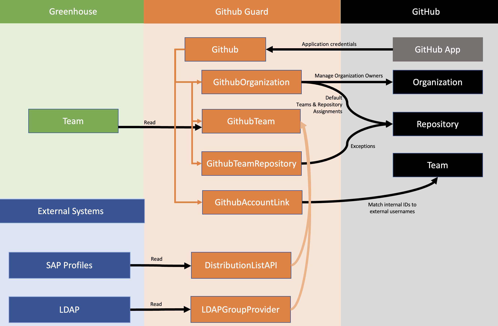
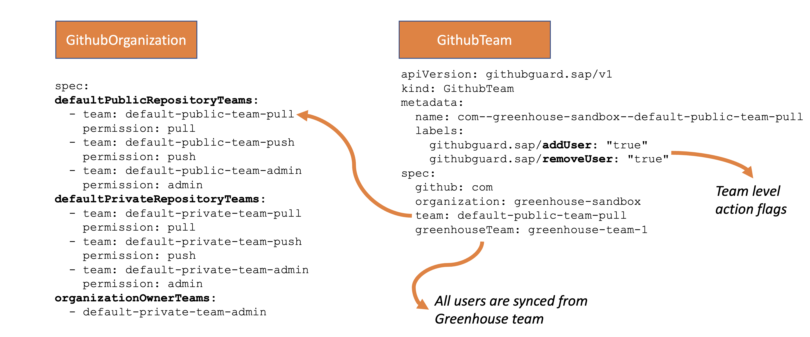
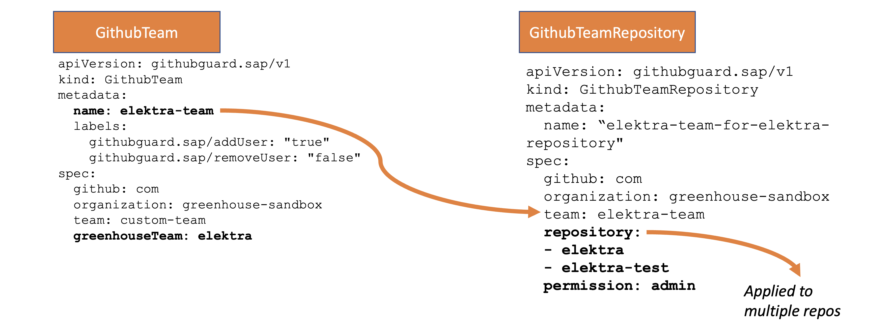

Repo Guard Greenhouse Plugin manages Github teams, team memberships and repository & team assignments.

## Hierarchy of Custom Resources



## Custom Resources

### `Github` – an installation of Github App

```
apiVersion: githubguard.sap/v1
kind: Github
metadata:
  name: com
spec:
  webURL: https://github.com
  v3APIURL: https://api.github.com
  integrationID: 123456
  clientUserAgent: greenhouse-repo-guard
  secret: github-com-secret
```

### `GithubOrganization` with Feature & Action Flags
```
apiVersion: githubguard.sap/v1
kind: GithubOrganization
metadata:
  name: com--greenhouse-sandbox
  labels:
    githubguard.sap/addTeam: "true"
    githubguard.sap/removeTeam: "true"
    githubguard.sap/addOrganizationOwner: "true"
    githubguard.sap/removeOrganizationOwner: "true"
    githubguard.sap/addRepositoryTeam: "true"
    githubguard.sap/removeRepositoryTeam: "true"
    githubguard.sap/dryRun: "false"
```

Default team & repository assignments:



### `GithubTeamRepository` for exception team & repository assignments 



### `GithubAccountLink` for external account matching
```
apiVersion: githubguard.sap/v1
kind: GithubAccountLink
metadata:
  annotations: 
   name: com-123456 
spec:
  userID: 123456
  githubID: 2042059
  github: com
```
