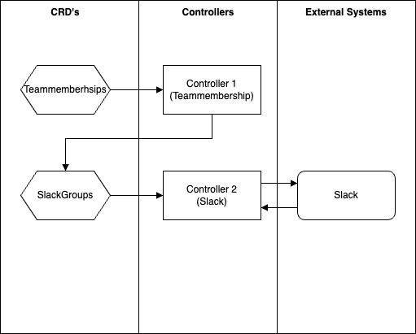

### Introduction
This Plugin provides a Slack integration for a Greenhouse organization.  
It manages Slack entities like channels, groups, handles, etc. and its members based on the teams configured in your Greenhouse organization.

**Important:** Please ensure that only one deployment of Teams2slack runs against the same set of groups in slack. Secondary instances should run in the provided Dry-Run mode. Otherwise you might notice inconsistencies if the Teammembership object of a cluster are uneqal.

### Requirments

* A Kubernetes Cluster to run against
* The presence of the Greenhouse Teammemberships CRD and corresponding objects.

### Architecture


The Teammembership contain the members of a team. Changes to an object will create an event in Kubernetes. This event will be consumed by the first controller. It creates a mirrored SlackGroup object that reflects the content of the Teammembership Object. This approach has the advantage that deletion of a team can be securely detected with the utilization of finalizers. The second controller detects changes on SlackGroup objects. The users present in a team will be aligned to a slack group.

### Configuration

Deploy a the Teams2Slack Plugin and it's Plugin which looks like the following structure (the following structure only includes the mandatory fields):

```yaml
apiVersion: greenhouse.sap/v1alpha1
kind: Plugin
metadata:
  name: teams2slack
  namespace: default
spec:
  pluginDefinition: teams2slack
  disabled: false
  optionValues:
    - name: groupNamePrefix
      value: 
    - name: groupNameSuffix
      value: 
    - name: infoChannelID
      value:
    - name: token
      valueFrom:
        secret:
          key: SLACK_TOKEN
          name: teams2slack-secret
---
apiVersion: v1
kind: Secret

metadata:
  name: teams2slack-secret
type: Opaque
data:
  SLACK_TOKEN: // Slack token b64 encoded
```
The values that can or need to be provided have the following meaning:

 Environment Variable     | Meaning                                                                                                                                                                                                                 |
|--------------------------|-------------------------------------------------------------------------------------------------------------------------------------------------------------------------------------------------------------------------|
| groupNamePrefix (mandatory)      | The prefix the created slack group should have. Choose a prefix that matches your organization.                                                                                                                         |
| groupNameSuffix (mandatory)       | The suffix the created slack group should have. Choose a suffix that matches your organization.                                                                                                                         |
| infoChannelID (mandatory)         | The channel ID created Slack Groups should have. You can currently define one slack ID which will be applied to all created groups. Make sure to take the channel ID and not the channel name.                          |
| token(mandatory)             | the slack token to authenticate against Slack.                                                                                                                                                                          |
| eventRequeueTimer (optional)     | If a slack API requests fails due to a network error, or because data is currently fetched, it will be requed to the operators workQueue. Uses the golang date format. (<br/>1s = every second <br/>1m = every minute ) |
| loadDataBackoffTimer (optional) | Defines, when a Slack-API data call occurs. Uses the golang data format.                                                                                                                                                
 | dryRun (optional)                 | Slack write operations are not executed if value is set to true. Requires a valid. Requires: A valid SLACK_TOKEN; the other environment variables can be mocked.                                                        |                                                                                                               |
