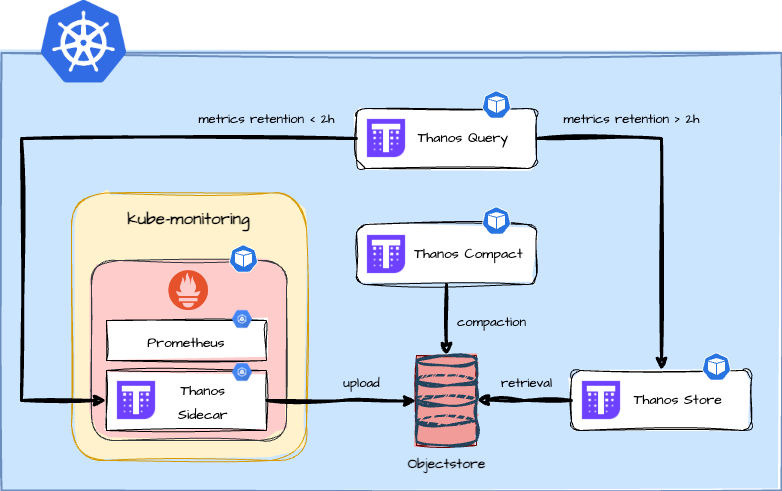
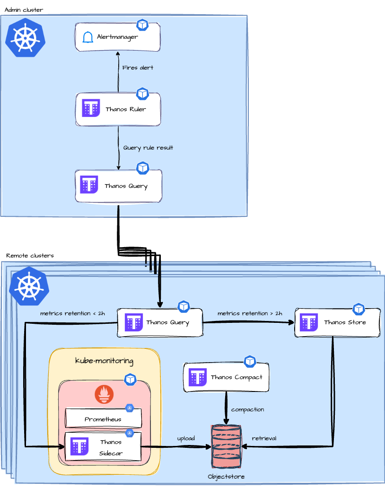

Learn more about the **Thanos** Plugin. Use it to enable extended metrics retention and querying across Prometheus servers and Greenhouse clusters.

The main terminologies used in this document can be found in [core-concepts](https://cloudoperators.github.io/greenhouse/docs/getting-started/core-concepts).

## Overview

Thanos is a set of components that can be used to extend the storage and retrieval of metrics in Prometheus. It allows you to store metrics in a remote object store and query them across multiple Prometheus servers and Greenhouse clusters. This Plugin is intended to provide a set of pre-configured Thanos components that enable a proven composition. At the core, a set of Thanos components is installed that adds long-term storage capability to a single **kube-monitoring** Plugin and makes both current and historical data available again via one Thanos Query component.



The **Thanos Sidecar** is a component that is deployed as a container together with a Prometheus instance. This allows Thanos to optionally upload metrics to the object store and Thanos Query to access Prometheus data via a common, efficient StoreAPI.

The **Thanos Compact** component applies the Prometheus 2.0 Storage Engine compaction process to data uploaded to the object store. The Compactor is also responsible for applying the configured retention and downsampling of the data.

The **Thanos Store** also implements the StoreAPI and serves the historical data from an object store. It acts primarily as an API gateway and has no persistence itself.

**Thanos Query** implements the Prometheus HTTP v1 API for querying data in a Thanos cluster via PromQL. In short, it collects the data needed to evaluate the query from the connected StoreAPIs, evaluates the query and returns the result.

This plugin deploys the following Thanos components:

* [Thanos Query](https://thanos.io/tip/components/query.md/)
* [Thanos Store](https://thanos.io/tip/components/store.md/)
* [Thanos Compactor](https://thanos.io/tip/components/compact.md/)
* [Thanos Ruler](https://thanos.io/tip/components/rule.md/)

Planned components:
* [Thanos Query Frontend](https://thanos.io/tip/components/query.md/)

This Plugin does **not** deploy the following components:
* [Thanos Sidecar](https://thanos.io/tip/components/sidecar.md/)
This component is installed in the [kube-monitoring](https://github.com/cloudoperators/greenhouse-extensions/tree/main/kube-monitoring) plugin.

## Disclaimer

It is not meant to be a comprehensive package that covers all scenarios. If you are an expert, feel free to configure the Plugin according to your needs.

Contribution is highly appreciated. If you discover bugs or want to add functionality to the plugin, then pull requests are always welcome.

## Quick start

This guide provides a quick and straightforward way to use **Thanos** as a Greenhouse Plugin on your Kubernetes cluster. The guide is meant to build the following setup.

**Prerequisites**

- A running and Greenhouse-onboarded Kubernetes cluster. If you don't have one, follow the [Cluster onboarding](https://cloudoperators.github.io/greenhouse/docs/user-guides/cluster/onboarding) guide.
- Ready to use credentials for a [compatible object store](https://thanos.io/tip/thanos/storage.md/)
- **kube-monitoring** plugin installed. Thanos Sidecar on the Prometheus must be [enabled](#kube-monitoring-plugin-enablement) by providing the required object store credentials.

**Step 1:**

Create a Kubernetes Secret with your object store credentials following the [Object Store preparation](#object-store-preparation) section.

**Step 2:**

Enable the Thanos Sidecar on the Prometheus in the **kube-monitoring** plugin by providing the required object store credentials. Follow the [kube-monitoring plugin enablement](#kube-monitoring-plugin-enablement) section.

**Step 3:**

Create a Thanos Query Plugin by following the [Thanos Query](#thanos-query) section.

## Configuration

### Object Store preparation

To run Thanos, you need object storage credentials. Get the credentials of your provider and add them to a Kubernetes Secret. The [Thanos documentation](https://thanos.io/tip/thanos/storage.md/) provides a great overview on the different supported store types.

Usually this looks somewhat like this

```yaml
type: $STORAGE_TYPE
config:
    user:
    password:
    domain:
    ...
```

If you've got everything in a file, deploy it in your remote cluster in the namespace, where Prometheus and Thanos will be.

**Important:** `$THANOS_PLUGIN_NAME` is needed later for the respective Thanos plugin and they must not be different!

```
kubectl create secret generic $THANOS_PLUGIN_NAME-metrics-objectstore --from-file=thanos.yaml=/path/to/your/file
```

### kube-monitoring plugin enablement

Prometheus in kube-monitoring needs to be altered to have a sidecar and ship metrics to the new object store too. You have to provide the Secret you've just created to the (most likely already existing) kube-monitoring plugin. Add this:

```yaml
spec:
    optionValues:
      - name: kubeMonitoring.prometheus.prometheusSpec.thanos.objectStorageConfig.existingSecret.key
        value: thanos.yaml
      - name: kubeMonitoring.prometheus.prometheusSpec.thanos.objectStorageConfig.existingSecret.name
        value: $THANOS_PLUGIN_NAME-metrics-objectstore
```

Values used here are described in the [Prometheus Operator Spec](https://prometheus-operator.dev/docs/api-reference/api/#monitoring.coreos.com/v1.ThanosSpec).

### Thanos Query

This is the real deal now: Define your Thanos Query by creating a plugin.

**NOTE1:** `$THANOS_PLUGIN_NAME` needs to be consistent with your secret created earlier.

**NOTE2:** The `releaseNamespace` needs to be the same as to where kube-monitoring resides. By default this is kube-monitoring.

```yaml
apiVersion: greenhouse.sap/v1alpha1
kind: Plugin
metadata:
  name: $YOUR_CLUSTER_NAME
spec:
  pluginDefinition: thanos
  disabled: false
  clusterName: $YOUR_CLUSTER_NAME
  releaseNamespace: kube-monitoring
```

### Thanos Ruler
Thanos Ruler evaluates Prometheus rules against choosen query API. This allows evaluation of rules using metrics from different Prometheus instances.


To enable Thanos Ruler component creation (Thanos Ruler is disabled by default) you have to set:

```yaml
spec:
  optionsValues:
  - name: thanos.ruler.enabled
    value: true
```

#### Configuration
##### Alertmanager
For Thanos Ruler to communicate with Alertmanager we need to enable the appropriate configuration and provide secret/key names containing necessary SSO key and certificate to the Plugin.

Example of Plugin setup with Thanos Ruler using Alertmanager
```yaml
spec:
  optionsValues:
  - name: thanos.ruler.enabled
    value: true
  - name: thanos.ruler.alertmanagers.enabled
    value: true
  - name: thanos.ruler.alertmanagers.authentication.ssoCert
    valueFrom:
      secret:
        key: $KEY_NAME
        name: $SECRET_NAME
  - name: thanos.ruler.alertmanagers.authentication.ssoKey
    valueFrom:
      secret:
        key: $KEY_NAME
        name: $SECRET_NAME
  ```

### [OPTIONAL] Handling your Prometheus and Thanos Stores.
#### Default Prometheus and Thanos Endpoint

Thanos Query is automatically adding the Prometheus and Thanos endpoints. If you just have a single Prometheus with Thanos enabled this will work out of the box. Details in the next two chapters. See [Standalone Query](#standalone-query) for your own configuration.

### Prometheus Endpoint
Thanos Query would check for a service `prometheus-operated` in the same namespace with this GRPC port to be available `10901`. The cli option looks like this and is configured in the Plugin itself:

`--store=prometheus-operated:10901`

### Thanos Endpoint
Thanos Query would check for a Thanos endpoint named like `releaseName-store`. The associated command line flag for this parameter would look like:

`--store=thanos-kube-store:10901`

If you just have one occurence of this Thanos plugin dpeloyed, the default option would work and does not need anything else.

### Standalone Query



In case you want to achieve a setup like above and have an overarching Thanos Query to run with multiple Stores, you can set it to `standalone` and add your own store list. Setup your Plugin like this:

```yaml
spec:
  optionsValues:
  - name: thanos.query.standalone
    value: true
```

This would enable you to either:

* query multiple stores with a single Query
    ```yaml
    spec:
      optionsValues:
      - name: thanos.query.stores
        value:
          - thanos-kube-1-store:10901
          - thanos-kube-2-store:10901
          - kube-monitoring-1-prometheus:10901
          - kube-monitoring-2-prometheus:10901
    ```
* query multiple Thanos Queries with a single Query
  Note that there is no `-store` suffix here in this case.

    ```yaml
    spec:
      optionsValues:
      - name: thanos.query.stores
        value:
          - thanos-kube-1:10901
          - thanos-kube-2:10901
    ```

### Query GRPC Ingress

To expose the Thanos Query GRPC endpoint externally, you can configure an ingress resource. This is useful for enabling external tools or other clusters to query the Thanos Query component.
Example configuration for enabling GRPC ingress:
```yaml
grpc:
  enabled: true
  hosts:
    - host: thanos.local
      paths:
        - path: /
          pathType: ImplementationSpecific
```

#### TLS Ingress

To enable TLS for the Thanos Query GRPC endpoint, you can configure a TLS secret. This is useful for securing the communication between external clients and the Thanos Query component.
Example configuration for enabling TLS ingress:
```yaml
tls: []
  - secretName: ingress-cert
    hosts: [thanos.local]
```

### Thanos Global Query

In the case of a multi-cluster setup, you may want your Thanos Query to be able to query all Thanos components in all clusters. This is possible by leveraging GRPC Ingress and TLS Ingress.
If your remote clusters are reachable via a common domain, you can add the endpoints of the remote clusters to the `stores` list in the Thanos Query configuration. This allows the Thanos Query to query all Thanos components across all clusters.
```yaml
spec:
  optionsValues:
  - name: thanos.query.stores
    value:
      - thanos.local-1:443
      - thanos.local-2:443
      - thanos.local-3:443
```
Pay attention to port numbers. The default port for GRPC is `443`.

### Disable Individual Thanos Components
It is possible to disable certain Thanos components for your deployment. To do so add the necessary configuration to your Plugin (currently it is not possible to disable the query component)
```yaml
- name: thanos.store.enabled
  value: false
- name: thanos.compactor.enabled
  value: false
```

| Thanos Component | Enabled by default	 | Deactivatable | Flag |
|---|---|---|---|
| Query | True | False | n/a |
| Store | True | True | thanos.store.enabled |
| Compactor | True | True | thanos.compactor.enabled |
| Ruler | False | True | thanos.ruler.enabled |
## Operations

### Thanos Compactor

If you deploy the plugin with the default values, Thanos compactor will be shipped too and use the same secret (`$THANOS_PLUGIN_NAME-metrics-objectstore`) to retrieve, compact and push back timeseries.

Based on experience, a 100Gi-PVC is used in order not to overload the ephermeral storage of the Kubernetes Nodes. Depending on the configured retention and the amount of metrics, this may not be sufficient and larger volumes may be required. In any case, it is always safe to clear the volume of the compactor and increase it if necessary.

The object storage costs will be heavily impacted on how granular timeseries are being stored (reference [Downsampling](https://thanos.io/tip/components/compact.md/#downsampling)). These are the pre-configured defaults, you can change them as needed:

```
raw: 777600s (90d)
5m: 777600s (90d)
1h: 157680000 (5y)
```

### Thanos ServiceMonitor

ServiceMonitor configures Prometheus to scrape metrics from all the deployed Thanos components.

To enable the creation of a ServiceMonitor we can use the Thanos Plugin configuration.

**NOTE**: You have to provide the serviceMonitorSelector matchLabels of your Prometheus instance. In the greenhouse context this should look like 'plugin: $PROMETHEUS_PLUGIN_NAME'

```yaml
spec:
  optionsValues:
  - name: thanos.serviceMonitor.selfMonitor
      value: true
  - name: thanos.serviceMonitor.labels
      value:
        plugin: $PROMETHEUS_PLUGIN_NAME
```

## Values

| Key | Type | Default | Description |
|-----|------|---------|-------------|
| global.commonLabels | object | the chart will add some internal labels automatically | Labels to apply to all resources |
| global.imageRegistry | string | `nil` | Overrides the registry globally for all images |
| thanos.compactor.additionalArgs | list | `[]` | Adding additional arguments to Thanos Compactor |
| thanos.compactor.annotations | object | `{}` | Annotations to add to the Thanos Compactor resources |
| thanos.compactor.compact.cleanupInterval | string | 1800s | Set Thanos Compactor compact.cleanup-interval |
| thanos.compactor.compact.concurrency | string | 1 | Set Thanos Compactor compact.concurrency |
| thanos.compactor.compact.waitInterval | string | 900s | Set Thanos Compactor wait-interval |
| thanos.compactor.consistencyDelay | string | 1800s | Set Thanos Compactor consistency-delay |
| thanos.compactor.containerLabels | object | `{}` | Labels to add to the Thanos Compactor container |
| thanos.compactor.deploymentLabels | object | `{}` | Labels to add to the Thanos Compactor deployment |
| thanos.compactor.enabled | bool | `true` | Enable Thanos Compactor component |
| thanos.compactor.httpGracePeriod | string | 120s | Set Thanos Compactor http-grace-period |
| thanos.compactor.logLevel | string | info | Thanos Compactor log level |
| thanos.compactor.retentionResolution1h | string | 157680000s | Set Thanos Compactor retention.resolution-1h |
| thanos.compactor.retentionResolution5m | string | 7776000s | Set Thanos Compactor retention.resolution-5m |
| thanos.compactor.retentionResolutionRaw | string | 7776000s | Set Thanos Compactor retention.resolution-raw |
| thanos.compactor.serviceLabels | object | `{}` | Labels to add to the Thanos Compactor service |
| thanos.compactor.volume.labels | list | `[]` | Labels to add to the Thanos Compactor PVC resource |
| thanos.compactor.volume.size | string | 100Gi | Set Thanos Compactor PersistentVolumeClaim size in Gi |
| thanos.grpcAddress | string | 0.0.0.0:10901 | GRPC-address used across the stack |
| thanos.httpAddress | string | 0.0.0.0:10902 | HTTP-address used across the stack |
| thanos.image.pullPolicy | string | `"IfNotPresent"` | Thanos image pull policy |
| thanos.image.repository | string | `"quay.io/thanos/thanos"` | Thanos image repository |
| thanos.image.tag | string | `"v0.38.0"` | Thanos image tag |
| thanos.query.additionalArgs | list | `[]` | Adding additional arguments to Thanos Query |
| thanos.query.annotations | object | `{}` | Annotations to add to the Thanos Query resources |
| thanos.query.autoDownsampling | bool | `true` |  |
| thanos.query.containerLabels | object | `{}` | Labels to add to the Thanos Query container |
| thanos.query.deploymentLabels | object | `{}` | Labels to add to the Thanos Query deployment |
| thanos.query.ingress.annotations | object | `{}` | Additional annotations for the Ingress resource. To enable certificate autogeneration, place here your cert-manager annotations. For a full list of possible ingress annotations, please see ref: https://github.com/kubernetes/ingress-nginx/blob/master/docs/user-guide/nginx-configuration/annotations.md |
| thanos.query.ingress.enabled | bool | `false` | Enable ingress controller resource |
| thanos.query.ingress.grpc.annotations | object | `{}` | Additional annotations for the Ingress resource.(GRPC) To enable certificate autogeneration, place here your cert-manager annotations. For a full list of possible ingress annotations, please see ref: https://github.com/kubernetes/ingress-nginx/blob/master/docs/user-guide/nginx-configuration/annotations.md |
| thanos.query.ingress.grpc.enabled | bool | `false` | Enable ingress controller resource.(GRPC) |
| thanos.query.ingress.grpc.hosts | list | `[{"host":"thanos.local","paths":[{"path":"/","pathType":"Prefix"}]}]` | Default host for the ingress resource.(GRPC) |
| thanos.query.ingress.grpc.ingressClassName | string | `""` | IngressClass that will be be used to implement the Ingress (Kubernetes 1.18+)(GRPC) This is supported in Kubernetes 1.18+ and required if you have more than one IngressClass marked as the default for your cluster . ref: https://kubernetes.io/blog/2020/04/02/improvements-to-the-ingress-api-in-kubernetes-1.18/  |
| thanos.query.ingress.grpc.tls | list | `[]` | Ingress TLS configuration. (GRPC) |
| thanos.query.ingress.hosts | list | `[{"host":"thanos.local","paths":[{"path":"/","pathType":"Prefix"}]}]` | Default host for the ingress resource |
| thanos.query.ingress.ingressClassName | string | `""` | IngressClass that will be be used to implement the Ingress (Kubernetes 1.18+) This is supported in Kubernetes 1.18+ and required if you have more than one IngressClass marked as the default for your cluster . ref: https://kubernetes.io/blog/2020/04/02/improvements-to-the-ingress-api-in-kubernetes-1.18/  |
| thanos.query.ingress.tls | list | `[]` | Ingress TLS configuration |
| thanos.query.logLevel | string | info | Thanos Query log level |
| thanos.query.persesDatasource.create | bool | `true` | Creates a Perses datasource for Thanos Query |
| thanos.query.persesDatasource.selector | object | `{}` | Label selectors for the Perses sidecar to detect this datasource. |
| thanos.query.plutonoDatasource.create | bool | `false` | Creates a Perses datasource for standalone Thanos Query |
| thanos.query.plutonoDatasource.selector | object | `{}` | Label selectors for the Plutono sidecar to detect this datasource. |
| thanos.query.replicaLabel | string | `nil` |  |
| thanos.query.replicas | string | `nil` | Number of Thanos Query replicas to deploy |
| thanos.query.serviceLabels | object | `{}` | Labels to add to the Thanos Query service |
| thanos.query.standalone | bool | `false` |  |
| thanos.query.stores | list | `[]` |  |
| thanos.query.tls.data | object | `{}` |  |
| thanos.query.tls.secretName | string | `""` |  |
| thanos.query.web.externalPrefix | string | `nil` |  |
| thanos.query.web.routePrefix | string | `nil` |  |
| thanos.ruler.alertmanagers | object | nil | Configures the list of Alertmanager endpoints to send alerts to. The configuration format is defined at https://thanos.io/tip/components/rule.md/#alertmanager. |
| thanos.ruler.alertmanagers.authentication.enabled | bool | `true` | Enable Alertmanager authentication for Thanos Ruler |
| thanos.ruler.alertmanagers.authentication.ssoCert | string | `nil` | SSO Cert for Alertmanager authentication |
| thanos.ruler.alertmanagers.authentication.ssoKey | string | `nil` | SSO Key for Alertmanager authentication |
| thanos.ruler.alertmanagers.enabled | bool | `true` | Enable Thanos Ruler Alertmanager config |
| thanos.ruler.alertmanagers.hosts | string | `nil` | List of hosts endpoints to send alerts to |
| thanos.ruler.annotations | object | `{}` | Annotations to add to the Thanos Ruler resources |
| thanos.ruler.enabled | bool | `false` | Enable Thanos Ruler components |
| thanos.ruler.externalPrefix | string | `"/ruler"` | Set Thanos Ruler external prefix |
| thanos.ruler.labels | object | `{}` | Labels to add to the Thanos Ruler deployment |
| thanos.ruler.matchLabel | string | `nil` | TO DO |
| thanos.ruler.serviceLabels | object | `{}` | Labels to add to the Thanos Ruler service |
| thanos.serviceMonitor.alertLabels | string | <pre> alertLabels: \| <br>   support_group: "default" <br>   meta: "" </pre> | Labels to add to the PrometheusRules alerts. |
| thanos.serviceMonitor.dashboards | bool | `true` | Create configmaps containing Perses dashboards |
| thanos.serviceMonitor.labels | object | `{}` | Labels to add to the ServiceMonitor/PrometheusRules. Make sure label is matching your Prometheus serviceMonitorSelector/ruleSelector configs by default Greenhouse kube-monitoring follows this label pattern `plugin: "{{ $.Release.Name }}"` |
| thanos.serviceMonitor.selfMonitor | bool | `false` | Create a ServiceMonitor and PrometheusRules for Thanos components. Disabled by default since label is required for Prometheus serviceMonitorSelector/ruleSelector. |
| thanos.store.additionalArgs | list | `[]` | Adding additional arguments to Thanos Store |
| thanos.store.annotations | object | `{}` | Annotations to add to the Thanos Store resources |
| thanos.store.chunkPoolSize | string | 4GB | Set Thanos Store chunk-pool-size |
| thanos.store.containerLabels | object | `{}` | Labels to add to the Thanos Store container |
| thanos.store.deploymentLabels | object | `{}` | Labels to add to the Thanos Store deployment |
| thanos.store.enabled | bool | `true` | Enable Thanos Store component |
| thanos.store.indexCacheSize | string | 1GB | Set Thanos Store index-cache-size |
| thanos.store.logLevel | string | info | Thanos Store log level |
| thanos.store.serviceLabels | object | `{}` | Labels to add to the Thanos Store service |